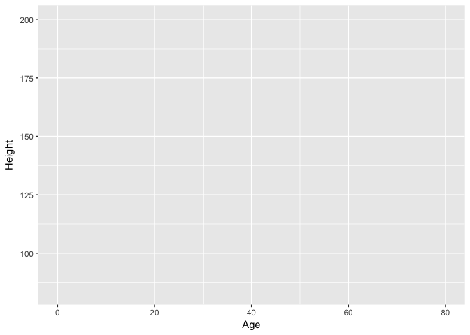
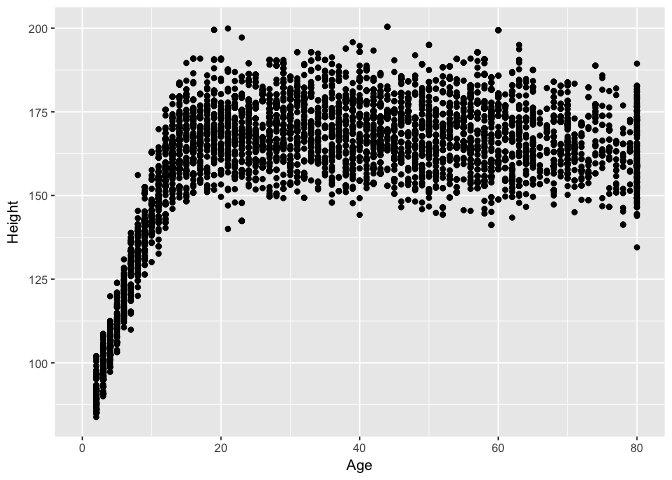
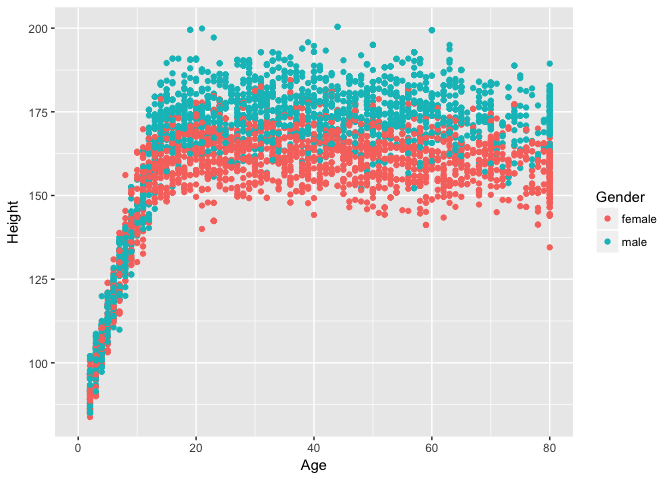
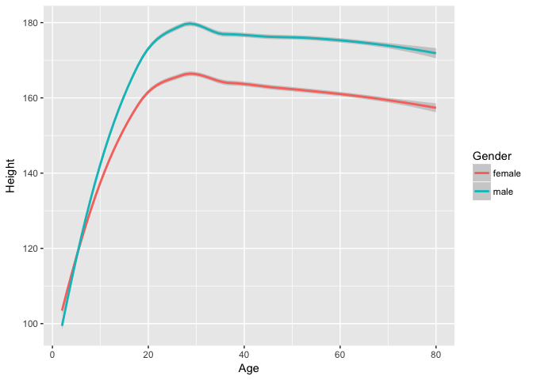
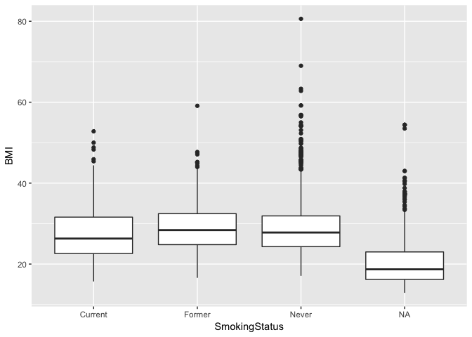
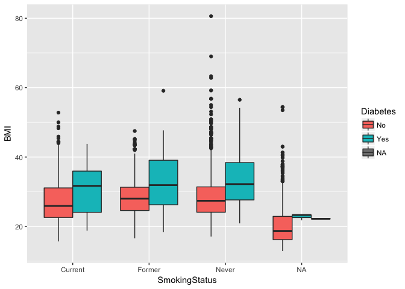
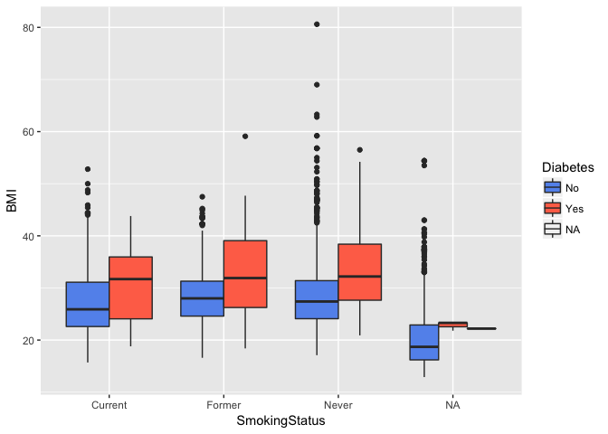
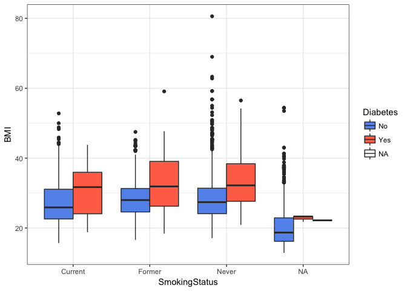
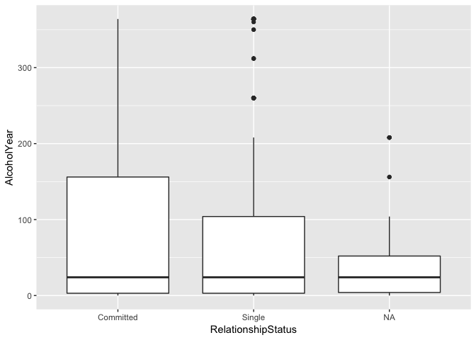
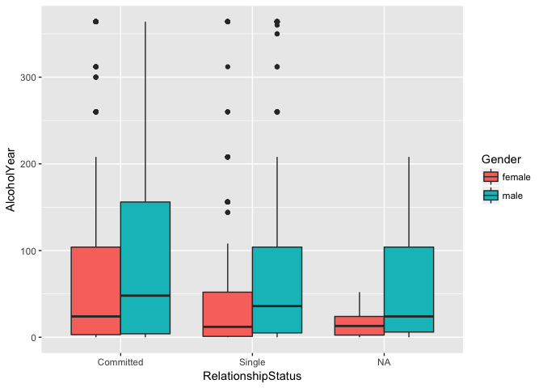

Essential Skills in R | Center for Brain Immunology and Glia
================
Marieke K Jones, PhD
04/11/2018
======
### Go over slides

### R Studio

Let's start by learning about RStudio. Open RStudio. **R** is the underlying statistical computing environment, but using R alone is no fun. **RStudio** is a graphical integrated development environment (IDE) that makes using R much easier.

-   Panes in RStudio. There are four panes:
    -   Editor in the top left
    -   Console bottom left
    -   Environment/history on the top right
    -   Plots/help on the bottom right.
-   To change your preferences for RStudio, go to Tools --&gt; Global Options
-   Change option for soft wrap

Set up Project and move dataset
-------------------------------

-   I mentioned that RStudio has a lot of pretty handy features ... one of those is the project structure

-   Before we can start writing code we need to set up our project workspace ... go to File and then click New Project ... and create this is a new directory ... for lack of a more creative example mine will be called IntroR and will be a subfolder of my home directory

-   When we start reading in data it'll be important that the *code and the data are in the same place.* Creating a project creates an Rproj file that opens R running *in that folder*. This way, when you want to read in dataset *whatever.txt*, you just tell it the filename rather than a full path. This is critical for reproducibility, and we'll talk about that more later

-   Now to get things arranged for later we need to download the dataset we are going to use from the library website. \_<https://data.hsl.virginia.edu/workshop-materials_>

-   Move our dataset to our IntroR directory. You can use whatever method you need ... if you're on Mac there's finder... or Windows my computer etc ... to move the gapminder.csv file into our R project directory **\[MOVE FILE\]** **\[STICKY CHECK\]**

-   Now that we have a project and the dataset, let's open up a new script and begin coding! Go to file new --&gt; new R script

Basic operations
----------------

-   Anything after a `#` sign is a comment. Use them liberally to *comment your code*.

-   R can be used as a glorified calculator. Make sure you're typing into into the editor, not the console, and save your script. Use the run button, or press `CMD`+`Enter` (`Ctrl`+`Enter` on Windows).

``` r
2+2
```

    ## [1] 4

``` r
5*4
```

    ## [1] 20

``` r
2^3
```

    ## [1] 8

R knows order of operations and scientific notation.

``` r
(5+3)^2 #8^2
```

    ## [1] 64

``` r
5+3^2 #5+9
```

    ## [1] 14

``` r
5e4
```

    ## [1] 50000

However, to do useful and interesting things, we need to assign *values* to *objects*. To create objects, we need to give it a name followed by the assignment operator `<-` and the value we want to give it:

``` r
weight_kg <- 55
```

`<-` is the assignment operator. Assigns values on the right to objects on the left, it is like an arrow that points from the value to the object. Mostly similar to `=` but not always. Learn to use `<-` as it is good programming practice. Using `=` in place of `<-` can lead to issues down the line. The keyboard shortcut for inserting the `<-` operator is `Alt-dash` on a pc or `option-dash` on a mac.

Objects can be given any name such as `x`, `current_temperature`, or `subject_id`. You want your object names to be explicit and not too long. They cannot start with a number (`2x` is not valid but `x2` is). R is case sensitive (e.g., `weight_kg` is different from `Weight_kg`). There are some names that cannot be used because they represent the names of fundamental functions in R. It is also recommended to use nouns for variable names, and verbs for function names.

When assigning a value to an object, R does not print anything. You can force to print the value by typing the name:

``` r
weight_kg
```

    ## [1] 55

Now that R has `weight_kg` in memory, we can do arithmetic with it. For instance, we may want to convert this weight in pounds (weight in pounds is 2.2 times the weight in kg).

``` r
2.2 * weight_kg
```

    ## [1] 121

We can also change a variable's value by assigning it a new one:

``` r
weight_kg <- 57.5
2.2 * weight_kg
```

    ## [1] 126.5

This means that assigning a value to one variable does not change the values of other variables. For example, let's store the animal's weight in pounds in a variable.

``` r
weight_lb <- 2.2 * weight_kg
```

and then change `weight_kg` to 100.

``` r
weight_kg <- 100
```

What do you think is the current content of the object `weight_lb`? 126.5 or 220?

------------------------------------------------------------------------

**EXERCISE 1**

A. You have a patient with a height (inches) of 73 and a weight (lbs) of 203. Create r objects labeled 'height' and 'weight'.

B. Convert 'weight' to 'weight\_kg' by dividing by 2.2. Convert 'height' to 'height\_m' by dividing by 39.37

C. Calculate a new object 'bmi' where BMI = weight\_kg / (height\_m\*height\_m)

``` r
height <- 73
weight <- 203

weight_kg <- weight / 2.2
height_m <- height / 39.37

bmi <- weight_kg / (height_m * height_m)
```

------------------------------------------------------------------------

Functions
---------

R has built-in functions.

``` r
sqrt(144)
```

    ## [1] 12

``` r
log(1000) #thought it would be 3
```

    ## [1] 6.907755

Get help by typing a question mark in front of the function's name, or `help(functionname)`:

``` r
help(log)
?log
```

-   The `base=` part inside the parentheses is called an *argument*, and most functions have arguments. Arguments modify the behavior of the function. Functions need some input (e.g., some data, an object) and arguments allow for options to change what the function will return, or how to treat the data provided.

-   Note syntax highlighting when typing this into the editor. Also note that I explicity told the log function the name of the `base` argument ... I didn't have to do this...

``` r
log(1000, base=10)
```

    ## [1] 3

``` r
log(1000,10)
```

    ## [1] 3

-   This also works just fine in this case... but it's worth pointing out that explicility calling out argument names will be necessary in some cases and improves readability of your code.

-   Another note about this example ... if we had paid a little more attention to the original call to the log function then we may not have had to dig into the help at all ...

``` r
#log()
```

-   Check out the code suggestion ... again with RStudio features ... so RStudio tells us as we type the function name what parameters it accepts ... pretty cool.

Nesting Functions
-----------------

In some cases you may need to use one function to derive the value you need to pass to another function ... if that sounds opaque maybe an example will help ...

``` r
sqrt(log(1000,base=10))
```

    ## [1] 1.732051

Because sqrt() takes a number ... and because log() outputs a number ... we can nest the two together And if we really wanted to make this a little easier to look at ... we could use the assignment operator to simplify things ...

``` r
myval <- log(1000,base=10)
sqrt(myval)
```

    ## [1] 1.732051

Vectors
-------

Create vectors using c() function (concatenate / combine)

``` r
c(1,2,5)
```

    ## [1] 1 2 5

``` r
c(1:5,11:15)
```

    ##  [1]  1  2  3  4  5 11 12 13 14 15

You could assign this vector to an object ... just like you would for one item Let's try assigning a vector of animal weights to an object

``` r
animal_weights <- c(50,60,66)
animal_weights
```

    ## [1] 50 60 66

You can also create a vector that contains characters

``` r
animals <- c("mouse", "rat", "dog")
animals
```

    ## [1] "mouse" "rat"   "dog"

There are a lot of functions that help you inspect a vector's contents ... length() is a good one ... it'll tell you how many elements are in a particular vector Let's try it on animals and animal\_weights

``` r
length(animals)
```

    ## [1] 3

``` r
length(animal_weights)
```

    ## [1] 3

Another helpful function is class() ... this will tell you what kind of object you're looking at

``` r
class(animals)
```

    ## [1] "character"

``` r
class(animal_weights)
```

    ## [1] "numeric"

This confirms that animals is a character vector and animal\_weights is a numeric vector

The str() function ... short for structure is particularly helpful ... This function gives you an overview of the object you're interested in

``` r
str(animal_weights)
```

    ##  num [1:3] 50 60 66

``` r
str(animals)
```

    ##  chr [1:3] "mouse" "rat" "dog"

-   There are no suprises in this case ... but once we get to data frames and other more complex objects ... we'll see how useful str() can be

-   If you wanted to extend an existing vector by an additonal element or elements you can do so with combine

``` r
animal_weights <- c(animal_weights, 80)
animal_weights <- c(49, animal_weights)
```

-   You can add elements to the beginning and end of a vector in this fashion

-   By reassigning the original vector each time we are overwriting its contents with the new data

-   We discussed classes a little while ago ... certain functions only operate on particular classes of objects ... for example sum will not work on characters

``` r
#sum(animals) errors out
sum(animal_weights)
```

    ## [1] 305

Data Frames
-----------

There are *lots* of different basic data structures in R. If you take any kind of longer introduction to R you'll probably learn about vectors, arrays, lists, matrices, etc. Let's skip straight to the data structure you'll probably use most -- the **data frame**. We use data frames to store heterogeneous tabular data in R: tabular, meaning that individuals or observations are typically represented in rows, while variables or features are represented as columns; heterogeneous, meaning that columns/features/variables can be different classes (on variable, e.g. age, can be numeric, while another, e.g., cause of death, can be text).

Our data
--------

-   We have the nhanes.csv file loaded into our project directory ... but we don't actually know anything about it yet
-   Let's load it into R so we can start exploring it
-   There are lots of ways to load data into R
-   We can use the point-and-click RStudio menu and go to Tools &gt; Import Data Set &gt; Import From Text File ... but that's not reproducible ...
-   The better way to read data in for analysis is to do so as part of your script
-   There are functions in R to load many different kinds of data
-   Today we will use tools from the tidyverse, so let's load that library now

``` r
#install.packages("tidyverse")
library(tidyverse)
```

    ## ── Attaching packages ─────────────────────────────────── tidyverse 1.2.1 ──

    ## ✔ ggplot2 2.2.1     ✔ purrr   0.2.5
    ## ✔ tibble  1.4.2     ✔ dplyr   0.7.6
    ## ✔ tidyr   0.8.1     ✔ stringr 1.3.1
    ## ✔ readr   1.1.1     ✔ forcats 0.3.0

    ## Warning: package 'dplyr' was built under R version 3.5.1

    ## ── Conflicts ────────────────────────────────────── tidyverse_conflicts() ──
    ## ✖ dplyr::filter() masks stats::filter()
    ## ✖ dplyr::lag()    masks stats::lag()

If you see a warning that looks like this: `Error in library(packageName) : there is no package called 'packageName'`, then you don't have the package installed correctly.

Once you have successfully loaded the tidyverse package, let's read in the data

``` r
nh <- read_csv("nhanes.csv")
```

    ## Parsed with column specification:
    ## cols(
    ##   .default = col_integer(),
    ##   Gender = col_character(),
    ##   Race = col_character(),
    ##   Education = col_character(),
    ##   MaritalStatus = col_character(),
    ##   RelationshipStatus = col_character(),
    ##   Insured = col_character(),
    ##   Poverty = col_double(),
    ##   HomeOwn = col_character(),
    ##   Work = col_character(),
    ##   Weight = col_double(),
    ##   Height = col_double(),
    ##   BMI = col_double(),
    ##   Testosterone = col_double(),
    ##   HDLChol = col_double(),
    ##   TotChol = col_double(),
    ##   Diabetes = col_character(),
    ##   PhysActive = col_character(),
    ##   SmokingStatus = col_character()
    ## )

    ## See spec(...) for full column specifications.

``` r
#look at data
nh
```

    ## # A tibble: 5,000 x 32
    ##       id Gender   Age Race    Education    MaritalStatus RelationshipStat…
    ##    <int> <chr>  <int> <chr>   <chr>        <chr>         <chr>            
    ##  1 62163 male      14 Asian   <NA>         <NA>          <NA>             
    ##  2 62172 female    43 Black   High School  NeverMarried  Single           
    ##  3 62174 male      80 White   College Grad Married       Committed        
    ##  4 62174 male      80 White   College Grad Married       Committed        
    ##  5 62175 male       5 White   <NA>         <NA>          <NA>             
    ##  6 62176 female    34 White   College Grad Married       Committed        
    ##  7 62178 male      80 White   High School  Widowed       Single           
    ##  8 62180 male      35 White   College Grad Married       Committed        
    ##  9 62186 female    17 Black   <NA>         <NA>          <NA>             
    ## 10 62190 female    15 Mexican <NA>         <NA>          <NA>             
    ## # ... with 4,990 more rows, and 25 more variables: Insured <chr>,
    ## #   Income <int>, Poverty <dbl>, HomeRooms <int>, HomeOwn <chr>,
    ## #   Work <chr>, Weight <dbl>, Height <dbl>, BMI <dbl>, Pulse <int>,
    ## #   BPSys <int>, BPDia <int>, Testosterone <dbl>, HDLChol <dbl>,
    ## #   TotChol <dbl>, Diabetes <chr>, DiabetesAge <int>, nPregnancies <int>,
    ## #   nBabies <int>, SleepHrsNight <int>, PhysActive <chr>,
    ## #   PhysActiveDays <int>, AlcoholDay <int>, AlcoholYear <int>,
    ## #   SmokingStatus <chr>

Now we can easily see the structure of the tibble

If you want to see the whole dataset, there are two ways to do this. First, you can click on the name of the data.frame in the **Environment** panel in RStudio. Or you could use the `View()` function (*with a capital V*).

``` r
#View(nh)
```

Inspecting data.frame objects
-----------------------------

There are several built-in functions that are useful for working with data frames and tibbles.

``` r
class(nh)
```

    ## [1] "tbl_df"     "tbl"        "data.frame"

``` r
head(nh) #note special coloring of NA
```

    ## # A tibble: 6 x 32
    ##      id Gender   Age Race  Education    MaritalStatus RelationshipStatus
    ##   <int> <chr>  <int> <chr> <chr>        <chr>         <chr>             
    ## 1 62163 male      14 Asian <NA>         <NA>          <NA>              
    ## 2 62172 female    43 Black High School  NeverMarried  Single            
    ## 3 62174 male      80 White College Grad Married       Committed         
    ## 4 62174 male      80 White College Grad Married       Committed         
    ## 5 62175 male       5 White <NA>         <NA>          <NA>              
    ## 6 62176 female    34 White College Grad Married       Committed         
    ## # ... with 25 more variables: Insured <chr>, Income <int>, Poverty <dbl>,
    ## #   HomeRooms <int>, HomeOwn <chr>, Work <chr>, Weight <dbl>,
    ## #   Height <dbl>, BMI <dbl>, Pulse <int>, BPSys <int>, BPDia <int>,
    ## #   Testosterone <dbl>, HDLChol <dbl>, TotChol <dbl>, Diabetes <chr>,
    ## #   DiabetesAge <int>, nPregnancies <int>, nBabies <int>,
    ## #   SleepHrsNight <int>, PhysActive <chr>, PhysActiveDays <int>,
    ## #   AlcoholDay <int>, AlcoholYear <int>, SmokingStatus <chr>

``` r
tail(nh)
```

    ## # A tibble: 6 x 32
    ##      id Gender   Age Race    Education     MaritalStatus RelationshipStat…
    ##   <int> <chr>  <int> <chr>   <chr>         <chr>         <chr>            
    ## 1 71909 male      28 Mexican 9 - 11th Gra… NeverMarried  Single           
    ## 2 71909 male      28 Mexican 9 - 11th Gra… NeverMarried  Single           
    ## 3 71910 female     0 White   <NA>          <NA>          <NA>             
    ## 4 71911 male      27 Mexican College Grad  Married       Committed        
    ## 5 71915 male      60 White   College Grad  NeverMarried  Single           
    ## 6 71915 male      60 White   College Grad  NeverMarried  Single           
    ## # ... with 25 more variables: Insured <chr>, Income <int>, Poverty <dbl>,
    ## #   HomeRooms <int>, HomeOwn <chr>, Work <chr>, Weight <dbl>,
    ## #   Height <dbl>, BMI <dbl>, Pulse <int>, BPSys <int>, BPDia <int>,
    ## #   Testosterone <dbl>, HDLChol <dbl>, TotChol <dbl>, Diabetes <chr>,
    ## #   DiabetesAge <int>, nPregnancies <int>, nBabies <int>,
    ## #   SleepHrsNight <int>, PhysActive <chr>, PhysActiveDays <int>,
    ## #   AlcoholDay <int>, AlcoholYear <int>, SmokingStatus <chr>

``` r
dim(nh)
```

    ## [1] 5000   32

``` r
names(nh)
```

    ##  [1] "id"                 "Gender"             "Age"               
    ##  [4] "Race"               "Education"          "MaritalStatus"     
    ##  [7] "RelationshipStatus" "Insured"            "Income"            
    ## [10] "Poverty"            "HomeRooms"          "HomeOwn"           
    ## [13] "Work"               "Weight"             "Height"            
    ## [16] "BMI"                "Pulse"              "BPSys"             
    ## [19] "BPDia"              "Testosterone"       "HDLChol"           
    ## [22] "TotChol"            "Diabetes"           "DiabetesAge"       
    ## [25] "nPregnancies"       "nBabies"            "SleepHrsNight"     
    ## [28] "PhysActive"         "PhysActiveDays"     "AlcoholDay"        
    ## [31] "AlcoholYear"        "SmokingStatus"

``` r
str(nh)
```

    ## Classes 'tbl_df', 'tbl' and 'data.frame':    5000 obs. of  32 variables:
    ##  $ id                : int  62163 62172 62174 62174 62175 62176 62178 62180 62186 62190 ...
    ##  $ Gender            : chr  "male" "female" "male" "male" ...
    ##  $ Age               : int  14 43 80 80 5 34 80 35 17 15 ...
    ##  $ Race              : chr  "Asian" "Black" "White" "White" ...
    ##  $ Education         : chr  NA "High School" "College Grad" "College Grad" ...
    ##  $ MaritalStatus     : chr  NA "NeverMarried" "Married" "Married" ...
    ##  $ RelationshipStatus: chr  NA "Single" "Committed" "Committed" ...
    ##  $ Insured           : chr  "Yes" "Yes" "Yes" "Yes" ...
    ##  $ Income            : int  100000 22500 70000 70000 12500 100000 2500 22500 22500 30000 ...
    ##  $ Poverty           : num  4.07 2.02 4.3 4.3 0.39 5 0.05 0.87 0.53 0.54 ...
    ##  $ HomeRooms         : int  6 4 7 7 7 8 6 6 6 4 ...
    ##  $ HomeOwn           : chr  "Rent" "Rent" "Own" "Own" ...
    ##  $ Work              : chr  NA "NotWorking" "NotWorking" "NotWorking" ...
    ##  $ Weight            : num  49.4 98.6 95.8 95.8 23.9 68.7 85.9 89 63.5 38.5 ...
    ##  $ Height            : num  169 172 168 168 120 ...
    ##  $ BMI               : num  17.3 33.3 33.9 33.9 16.7 23.3 28.5 27.9 22.9 17 ...
    ##  $ Pulse             : int  72 80 56 56 NA 92 68 66 86 76 ...
    ##  $ BPSys             : int  107 103 97 97 NA 107 121 107 108 113 ...
    ##  $ BPDia             : int  37 72 39 39 NA 69 72 66 64 27 ...
    ##  $ Testosterone      : num  274.9 47.5 642.8 642.8 NA ...
    ##  $ HDLChol           : num  1.14 1.89 1.4 1.4 NA 1.42 1.22 0.85 1.4 1.63 ...
    ##  $ TotChol           : num  3.98 4.37 5.25 5.25 NA 4.42 5.2 3.7 3.21 4.11 ...
    ##  $ Diabetes          : chr  "No" "No" "No" "No" ...
    ##  $ DiabetesAge       : int  NA NA NA NA NA NA NA NA NA NA ...
    ##  $ nPregnancies      : int  NA 3 NA NA NA 5 NA NA NA NA ...
    ##  $ nBabies           : int  NA 2 NA NA NA 2 NA NA NA NA ...
    ##  $ SleepHrsNight     : int  NA 8 9 9 NA 7 6 7 7 NA ...
    ##  $ PhysActive        : chr  "No" "No" "No" "No" ...
    ##  $ PhysActiveDays    : int  1 2 7 5 7 5 NA NA 4 7 ...
    ##  $ AlcoholDay        : int  NA 3 NA NA NA 2 NA 1 NA NA ...
    ##  $ AlcoholYear       : int  NA 104 0 0 NA 104 NA 2 NA NA ...
    ##  $ SmokingStatus     : chr  NA "Current" "Never" "Never" ...
    ##  - attr(*, "spec")=List of 2
    ##   ..$ cols   :List of 32
    ##   .. ..$ id                : list()
    ##   .. .. ..- attr(*, "class")= chr  "collector_integer" "collector"
    ##   .. ..$ Gender            : list()
    ##   .. .. ..- attr(*, "class")= chr  "collector_character" "collector"
    ##   .. ..$ Age               : list()
    ##   .. .. ..- attr(*, "class")= chr  "collector_integer" "collector"
    ##   .. ..$ Race              : list()
    ##   .. .. ..- attr(*, "class")= chr  "collector_character" "collector"
    ##   .. ..$ Education         : list()
    ##   .. .. ..- attr(*, "class")= chr  "collector_character" "collector"
    ##   .. ..$ MaritalStatus     : list()
    ##   .. .. ..- attr(*, "class")= chr  "collector_character" "collector"
    ##   .. ..$ RelationshipStatus: list()
    ##   .. .. ..- attr(*, "class")= chr  "collector_character" "collector"
    ##   .. ..$ Insured           : list()
    ##   .. .. ..- attr(*, "class")= chr  "collector_character" "collector"
    ##   .. ..$ Income            : list()
    ##   .. .. ..- attr(*, "class")= chr  "collector_integer" "collector"
    ##   .. ..$ Poverty           : list()
    ##   .. .. ..- attr(*, "class")= chr  "collector_double" "collector"
    ##   .. ..$ HomeRooms         : list()
    ##   .. .. ..- attr(*, "class")= chr  "collector_integer" "collector"
    ##   .. ..$ HomeOwn           : list()
    ##   .. .. ..- attr(*, "class")= chr  "collector_character" "collector"
    ##   .. ..$ Work              : list()
    ##   .. .. ..- attr(*, "class")= chr  "collector_character" "collector"
    ##   .. ..$ Weight            : list()
    ##   .. .. ..- attr(*, "class")= chr  "collector_double" "collector"
    ##   .. ..$ Height            : list()
    ##   .. .. ..- attr(*, "class")= chr  "collector_double" "collector"
    ##   .. ..$ BMI               : list()
    ##   .. .. ..- attr(*, "class")= chr  "collector_double" "collector"
    ##   .. ..$ Pulse             : list()
    ##   .. .. ..- attr(*, "class")= chr  "collector_integer" "collector"
    ##   .. ..$ BPSys             : list()
    ##   .. .. ..- attr(*, "class")= chr  "collector_integer" "collector"
    ##   .. ..$ BPDia             : list()
    ##   .. .. ..- attr(*, "class")= chr  "collector_integer" "collector"
    ##   .. ..$ Testosterone      : list()
    ##   .. .. ..- attr(*, "class")= chr  "collector_double" "collector"
    ##   .. ..$ HDLChol           : list()
    ##   .. .. ..- attr(*, "class")= chr  "collector_double" "collector"
    ##   .. ..$ TotChol           : list()
    ##   .. .. ..- attr(*, "class")= chr  "collector_double" "collector"
    ##   .. ..$ Diabetes          : list()
    ##   .. .. ..- attr(*, "class")= chr  "collector_character" "collector"
    ##   .. ..$ DiabetesAge       : list()
    ##   .. .. ..- attr(*, "class")= chr  "collector_integer" "collector"
    ##   .. ..$ nPregnancies      : list()
    ##   .. .. ..- attr(*, "class")= chr  "collector_integer" "collector"
    ##   .. ..$ nBabies           : list()
    ##   .. .. ..- attr(*, "class")= chr  "collector_integer" "collector"
    ##   .. ..$ SleepHrsNight     : list()
    ##   .. .. ..- attr(*, "class")= chr  "collector_integer" "collector"
    ##   .. ..$ PhysActive        : list()
    ##   .. .. ..- attr(*, "class")= chr  "collector_character" "collector"
    ##   .. ..$ PhysActiveDays    : list()
    ##   .. .. ..- attr(*, "class")= chr  "collector_integer" "collector"
    ##   .. ..$ AlcoholDay        : list()
    ##   .. .. ..- attr(*, "class")= chr  "collector_integer" "collector"
    ##   .. ..$ AlcoholYear       : list()
    ##   .. .. ..- attr(*, "class")= chr  "collector_integer" "collector"
    ##   .. ..$ SmokingStatus     : list()
    ##   .. .. ..- attr(*, "class")= chr  "collector_character" "collector"
    ##   ..$ default: list()
    ##   .. ..- attr(*, "class")= chr  "collector_guess" "collector"
    ##   ..- attr(*, "class")= chr "col_spec"

``` r
summary(nh) #note NA
```

    ##        id           Gender               Age            Race          
    ##  Min.   :62163   Length:5000        Min.   : 0.00   Length:5000       
    ##  1st Qu.:64544   Class :character   1st Qu.:17.00   Class :character  
    ##  Median :67039   Mode  :character   Median :36.00   Mode  :character  
    ##  Mean   :67028                      Mean   :36.71                     
    ##  3rd Qu.:69509                      3rd Qu.:54.00                     
    ##  Max.   :71915                      Max.   :80.00                     
    ##                                                                       
    ##   Education         MaritalStatus      RelationshipStatus
    ##  Length:5000        Length:5000        Length:5000       
    ##  Class :character   Class :character   Class :character  
    ##  Mode  :character   Mode  :character   Mode  :character  
    ##                                                          
    ##                                                          
    ##                                                          
    ##                                                          
    ##    Insured              Income          Poverty        HomeRooms     
    ##  Length:5000        Min.   :  2500   Min.   :0.000   Min.   : 1.000  
    ##  Class :character   1st Qu.: 30000   1st Qu.:1.190   1st Qu.: 4.000  
    ##  Mode  :character   Median : 50000   Median :2.600   Median : 6.000  
    ##                     Mean   : 57078   Mean   :2.761   Mean   : 6.193  
    ##                     3rd Qu.:100000   3rd Qu.:4.760   3rd Qu.: 8.000  
    ##                     Max.   :100000   Max.   :5.000   Max.   :13.000  
    ##                     NA's   :377      NA's   :325     NA's   :28      
    ##    HomeOwn              Work               Weight           Height     
    ##  Length:5000        Length:5000        Min.   :  3.60   Min.   : 83.8  
    ##  Class :character   Class :character   1st Qu.: 55.40   1st Qu.:156.5  
    ##  Mode  :character   Mode  :character   Median : 72.10   Median :165.6  
    ##                                        Mean   : 70.33   Mean   :161.5  
    ##                                        3rd Qu.: 88.10   3rd Qu.:174.2  
    ##                                        Max.   :198.70   Max.   :200.4  
    ##                                        NA's   :31       NA's   :159    
    ##       BMI            Pulse            BPSys           BPDia      
    ##  Min.   :12.90   Min.   : 40.00   Min.   : 79.0   Min.   :  0.0  
    ##  1st Qu.:21.50   1st Qu.: 66.00   1st Qu.:107.0   1st Qu.: 62.0  
    ##  Median :25.80   Median : 72.00   Median :116.0   Median : 69.0  
    ##  Mean   :26.44   Mean   : 73.63   Mean   :118.7   Mean   : 68.3  
    ##  3rd Qu.:30.60   3rd Qu.: 82.00   3rd Qu.:128.0   3rd Qu.: 77.0  
    ##  Max.   :80.60   Max.   :136.00   Max.   :221.0   Max.   :116.0  
    ##  NA's   :166     NA's   :718      NA's   :719     NA's   :719    
    ##   Testosterone        HDLChol         TotChol         Diabetes        
    ##  Min.   :   0.25   Min.   :0.410   Min.   : 1.530   Length:5000       
    ##  1st Qu.:  17.70   1st Qu.:1.090   1st Qu.: 4.060   Class :character  
    ##  Median :  43.82   Median :1.290   Median : 4.730   Mode  :character  
    ##  Mean   : 197.90   Mean   :1.361   Mean   : 4.831                     
    ##  3rd Qu.: 362.41   3rd Qu.:1.580   3rd Qu.: 5.510                     
    ##  Max.   :1795.60   Max.   :4.030   Max.   :12.280                     
    ##  NA's   :874       NA's   :775     NA's   :775                        
    ##   DiabetesAge     nPregnancies       nBabies       SleepHrsNight   
    ##  Min.   : 1.00   Min.   : 1.000   Min.   : 0.000   Min.   : 2.000  
    ##  1st Qu.:39.00   1st Qu.: 2.000   1st Qu.: 2.000   1st Qu.: 6.000  
    ##  Median :50.00   Median : 3.000   Median : 2.000   Median : 7.000  
    ##  Mean   :47.61   Mean   : 2.924   Mean   : 2.375   Mean   : 6.906  
    ##  3rd Qu.:57.00   3rd Qu.: 4.000   3rd Qu.: 3.000   3rd Qu.: 8.000  
    ##  Max.   :80.00   Max.   :13.000   Max.   :11.000   Max.   :12.000  
    ##  NA's   :4693    NA's   :3735     NA's   :3832     NA's   :1166    
    ##   PhysActive        PhysActiveDays    AlcoholDay      AlcoholYear    
    ##  Length:5000        Min.   :1.000   Min.   : 1.000   Min.   :  0.00  
    ##  Class :character   1st Qu.:2.000   1st Qu.: 1.000   1st Qu.:  3.00  
    ##  Mode  :character   Median :4.000   Median : 2.000   Median : 24.00  
    ##                     Mean   :3.819   Mean   : 2.925   Mean   : 74.86  
    ##                     3rd Qu.:5.000   3rd Qu.: 3.000   3rd Qu.:104.00  
    ##                     Max.   :7.000   Max.   :82.000   Max.   :364.00  
    ##                     NA's   :2614    NA's   :2503     NA's   :2016    
    ##  SmokingStatus     
    ##  Length:5000       
    ##  Class :character  
    ##  Mode  :character  
    ##                    
    ##                    
    ##                    
    ## 

Accessing variables & subsetting data frames
--------------------------------------------

We can access individual variables within a data frame using the `$` operator, e.g., `mydataframe$specificVariable`. Let's print out the BMI variable. Then let's calculate the average BMI across all the data (using the built-in `mean()` function).

``` r
# display all weight entries
nh$BMI
```

    ##    [1] 17.3 33.3 33.9 33.9 16.7 23.3 28.5 27.9 22.9 17.0 28.0 28.0 28.0
    ##   [14] 28.0 28.9 28.9 28.9 28.9 29.1 22.2 26.0 26.0 18.4 40.4 25.0 25.0
    ##   [27] 25.0 25.0 20.5 20.1 22.7 43.4 43.4 43.4 28.6 33.2 31.6 45.2 15.7
    ##   [40] 39.9 39.9   NA 27.0 27.0 17.2 17.2 26.0 23.1 31.0 41.7 18.4 19.1
    ##   [53] 24.1 13.3 25.0 21.9 21.9 25.6 25.6 33.1 33.1 29.9 29.9 32.7 31.1
    ##   [66] 31.1 26.6 26.6 33.0 33.0 25.4 24.6 24.6 31.1 30.0 15.1 26.4 26.4
    ##   [79] 14.9 18.4 28.5 25.9 25.9 25.9 25.9 15.0 32.9 32.9 32.9 31.9 31.9
    ##   [92] 27.4 24.0 38.0 38.0 22.3 22.3 22.3 18.7 17.8 17.8 25.6 25.6 25.6
    ##  [105] 25.8 21.7 22.0 18.3 33.2 26.7 38.4 38.4 40.6 30.7 23.7 14.0 40.0
    ##  [118] 40.0 40.0 40.0 26.7 26.7 26.7 26.7 31.6 23.5 23.5 23.5 23.5 26.5
    ##  [131] 29.0 29.0 30.4 22.2 23.4   NA 27.2 27.2 33.0 30.2 33.6 33.6   NA
    ##  [144] 36.8 18.8 14.8 14.8 14.8 14.8 14.8 21.9 21.9 22.0 25.6 25.6 25.6
    ##  [157] 25.6   NA 28.0 28.0 25.8 28.1 28.5 27.7 27.7 26.5 23.8 23.8 25.5
    ##  [170] 27.8   NA 28.6 28.6 20.8 16.0 16.0 25.6 25.6 28.4 28.4 29.8 29.8
    ##  [183] 32.3 32.3   NA 23.1 23.1 30.1 24.0 36.3 27.5 27.5 25.6 16.2 36.5
    ##  [196] 21.5 18.9 48.2 48.2 22.5 22.5 22.5 22.5 20.2 20.2 20.2 17.8 22.1
    ##  [209] 27.8 27.8 27.8 22.0 22.0 22.0 22.0 35.6 25.0 17.0 17.0 17.0 17.0
    ##  [222]   NA   NA 23.2 40.1 40.1 40.1 20.7 20.7 20.7 20.7 20.7 16.0 16.2
    ##  [235] 34.5 23.8 25.8 25.8 25.8 22.2 22.2 30.5 19.3 24.9 28.8 26.9 31.0
    ##  [248] 31.0 31.0 23.8 23.8 48.3 32.6 32.6 24.3 42.0 42.0 42.0 36.6 39.5
    ##  [261]   NA   NA 21.2 28.2 39.4 17.5 17.5 19.5 21.5 21.5 21.4 34.0 34.0
    ##  [274] 22.5 38.7 43.5 43.5 19.1 24.8 33.3 21.3 21.3 29.6 27.0 23.3 26.1
    ##  [287] 26.1 26.1 26.1 26.1   NA 26.1 26.1 30.8 30.8   NA 23.6 22.4 22.4
    ##  [300] 26.4 29.2 28.0 20.8 36.1 31.8 48.6 26.8   NA   NA 38.1 25.4 14.8
    ##  [313] 14.8 14.8 25.4 15.4 14.6   NA 20.1 20.1 36.4 15.8 22.6 31.8 29.6
    ##  [326] 29.9 29.9 29.9 29.9 29.0 25.8 21.5 21.5 21.5 16.8 22.6 22.6 22.6
    ##  [339] 30.8 30.8 30.8 30.8 30.8 25.0 30.8 21.0 32.6 27.6 31.9 21.2 25.1
    ##  [352] 34.8   NA 32.7 20.6 36.0 36.0 35.8 28.8 24.0 20.4 38.0 38.0 38.0
    ##  [365] 38.0 18.4 18.4 29.9 16.2 17.0 31.5 19.3 34.7 33.5 23.3 23.3 39.8
    ##  [378] 26.4 26.4 26.4 25.0 25.0 25.0 25.1 21.0 29.7 29.7 29.7 16.7 30.5
    ##  [391] 24.5 27.1 27.1 20.0 20.0 21.9 15.9 15.9 31.7 24.0 15.5 22.7 22.7
    ##  [404] 22.7 30.8 30.8 30.8 30.8 30.8 30.8 30.8   NA 44.4 34.8 40.6 40.6
    ##  [417] 29.4 16.5 16.6 15.6 15.6 15.6 15.6 22.2 25.4 25.4 37.9 23.3 23.3
    ##  [430] 54.4 54.4 54.4 54.4 23.6 33.6 22.7 14.4   NA 23.3 24.3 24.3 24.3
    ##  [443] 24.5 36.4 38.8 34.1 34.1 34.1 27.6 27.6 34.2 34.2 34.2 34.2 20.7
    ##  [456] 30.1 22.6 22.2 23.7 28.9 28.9 28.9 22.4 22.4 18.5 25.9 30.8 17.0
    ##  [469] 32.2 27.1 27.1 35.0   NA   NA   NA   NA   NA 13.6 18.9 20.8 13.5
    ##  [482] 15.8 15.8 18.0 18.0 29.9 37.3 24.4 24.4 22.0 22.1 22.1 22.1 34.3
    ##  [495] 15.7 15.7 15.7 26.9 26.9 16.1 16.1 16.1 30.3 30.3 30.3 30.3 28.4
    ##  [508] 21.6 21.6 18.6 17.8 17.8 17.8 27.9 27.9 36.3 19.9 27.0 18.9 25.3
    ##  [521] 27.0 27.7 18.0 18.0 29.3 29.8 34.6 25.7 25.7 25.7 34.3 34.3 25.1
    ##  [534] 30.0 23.6 23.6 23.6 23.6 23.6 22.5 22.5 22.0 15.9 15.9 27.8 27.8
    ##  [547] 24.2 29.0 37.6 36.3 38.9 27.8 27.8 27.8 27.8 27.8 27.8   NA 24.4
    ##  [560] 54.2 27.4 24.2 26.3 34.6 26.6 26.9 26.9   NA 20.8 20.0 20.0 40.8
    ##  [573] 40.8 59.1 30.3 20.6 32.8 32.8 29.3 29.3 18.2 28.2 28.2 25.0 24.6
    ##  [586] 24.6 29.4 25.4 17.1 47.5 25.5 25.5 19.1 21.3 22.0 22.0 41.7 41.7
    ##  [599] 22.3 22.3 30.2 30.2 30.6 30.6 26.2 34.3 23.3 23.2 30.6 30.6 30.6
    ##  [612] 30.6 30.6 30.6 30.6 24.5 16.1 22.6 22.6 22.6 40.0 16.5 22.9 32.1
    ##  [625] 23.5 23.5 25.6 20.9 17.7 17.7 17.3 21.0 20.2 20.2 20.2 20.2 20.2
    ##  [638] 20.2 22.5 30.4 43.0 21.0 41.8 31.0   NA 22.9 31.5 25.6 16.8 26.2
    ##  [651] 27.3 23.5 14.8 23.9 22.7 34.1 34.1 34.1 34.1 34.1 34.1 30.7 20.1
    ##  [664] 27.3 26.6 26.6 21.0 21.0 21.0 32.4 31.7 31.7 31.7 26.6 26.6 15.0
    ##  [677]   NA 22.0 26.9 16.5 14.9 14.9 21.2 24.2 24.2 24.2 24.2 24.2 30.3
    ##  [690] 20.1 37.7 37.7 14.4 28.4 38.5 38.5 40.0 33.7 21.7 21.7 21.7 21.7
    ##  [703] 21.7 24.6 24.6 24.6 24.6 20.8 25.4 25.4 20.5 15.8 24.1 29.8 24.3
    ##  [716] 37.8 37.8 18.4 29.5 29.5 29.5 26.0 16.2 31.8 21.1 21.1 21.6 21.6
    ##  [729] 21.6 32.2 27.1   NA   NA 21.0 21.1 21.1 16.0 31.0 31.0 31.0 28.0
    ##  [742] 27.3 16.3 26.6 36.0 15.5 25.1 25.1 16.7 28.6 28.6 28.6 28.6 31.1
    ##  [755] 15.3 15.3 14.7 18.4 18.4 31.1 31.1 33.8 27.7 16.1 16.1 23.1 23.1
    ##  [768] 29.8 19.5 19.5 29.9 31.9 32.4 38.8 24.5 24.7 24.7 26.7 24.3 31.5
    ##  [781] 19.5 23.6 23.6 23.2 23.2   NA 23.9 23.9 23.9 25.5 28.7 24.5 24.5
    ##  [794] 30.6   NA 21.0 21.0 35.0 35.0 35.0 32.0 28.9 32.0 32.0   NA   NA
    ##  [807] 30.6 18.3 18.3 28.3 17.4 29.7 27.3 29.6 29.6 30.1 32.7 15.2 15.2
    ##  [820] 15.2 15.2 18.1 30.3   NA 20.3 20.3 20.3 28.8 28.8 26.4 26.4 31.6
    ##  [833] 22.0 33.5 33.5 33.5 31.9 25.7 25.7 25.7 22.4   NA 15.7 36.1 26.3
    ##  [846] 26.3 36.7 36.7 36.7 36.7 19.3 18.3 18.3 27.9 15.2 21.6 21.6 21.6
    ##  [859] 28.9 31.1 36.7 27.2 22.0 22.0 22.0 22.0 22.0 22.0 16.9 21.8 22.0
    ##  [872] 28.3 28.3 27.4 27.4 39.9 15.8   NA 23.3 18.2 18.2 18.2 18.2 25.8
    ##  [885] 25.8 14.8 14.8 26.4 26.4 26.4 26.4 26.4 23.2 23.2 15.4 15.4 15.4
    ##  [898] 23.5 14.2 19.0 50.0 19.3 34.8 24.4 26.1 26.1 26.1 25.6 34.4 34.4
    ##  [911] 39.7 14.5 28.1 28.1 28.1 30.1 30.1 30.1 28.9 32.0 32.0 32.0 16.3
    ##  [924] 27.3 20.0 20.0 20.0 25.8 25.8 33.6 15.9 17.7 17.7 20.5 20.5 19.0
    ##  [937] 21.2 21.2 14.1 40.1 21.4 21.4 28.3 31.6 29.6 29.6   NA   NA 31.9
    ##  [950] 32.2 32.2 27.4 29.4 29.4 29.4 29.4 41.9 27.0 34.6 19.0 32.2 18.1
    ##  [963] 18.1 18.1 18.1 18.1 29.4 30.1 28.1 28.1 21.7 21.7 41.6 25.7 42.0
    ##  [976] 19.9 26.3 26.3 26.3 26.3 14.0 25.3 18.1 19.3 19.3 32.7 27.0   NA
    ##  [989] 26.9 24.3 24.3 22.5 20.5 29.0 29.0 24.5 24.5 47.2 32.0 32.0 30.3
    ## [1002]   NA 33.0 26.9 26.9 26.9 20.3 20.3 31.8 26.2 26.2 29.5 29.5 31.7
    ## [1015] 22.6 29.3 29.3 29.3 14.2 25.6   NA 34.2 27.5 27.5 27.5 18.1 21.2
    ## [1028] 24.7 18.6 31.1 16.3 26.0 26.0 22.5 24.4 33.1 15.8 24.1 24.1 24.1
    ## [1041] 24.1 16.5   NA   NA 39.2 22.1 28.3 23.5   NA   NA 34.7 34.7 26.3
    ## [1054] 17.9 19.7 19.7 19.7 19.7 26.1 24.6 35.1 35.1 21.2 27.0 31.9 36.3
    ## [1067] 36.3 22.0 28.5 15.6 28.7 18.3 15.3   NA 21.3 21.3 19.0 40.1 20.4
    ## [1080] 20.4 24.9 24.9 24.9 24.9 24.9 37.0 37.0 37.0 37.0 37.0 36.5 21.3
    ## [1093] 22.5 23.5 23.7 23.7 24.7 24.7 24.9 12.9 17.7 31.5 31.5 26.5 37.3
    ## [1106] 37.3 42.0 18.1 29.8 28.9 28.9 27.6 16.5 16.5 16.5 36.6 36.6 16.0
    ## [1119] 24.0 24.0   NA 30.3 20.7 33.5 22.5 37.4 37.4 31.8 35.5 29.9 29.9
    ## [1132] 31.4 24.9 24.9 24.9 24.9 25.5 25.5 24.2 24.2 19.3 25.7 18.4 30.5
    ## [1145] 30.5 28.7 18.2 32.4 17.2 47.7 20.6 18.8 17.6 17.6 25.7 31.4 22.7
    ## [1158] 15.4 23.3 24.3 22.9 19.4 22.5 18.0 18.0 24.0 33.0 33.0 21.7 21.7
    ## [1171] 23.7 16.9 29.0 29.0 29.0 35.6 16.6 25.4 30.5 30.5 30.5 33.0 33.0
    ## [1184] 31.1 31.1 31.1 20.8 21.9 20.0 36.5 36.5 36.5 36.5 15.4 28.4 16.2
    ## [1197] 16.2 26.3 26.3 26.2 21.8 26.3 24.7 27.7 16.3 16.3 36.2 23.9   NA
    ## [1210] 23.4 29.8 26.5 25.5 40.1 22.5 35.4 25.1 25.1 25.1 25.1 32.7 32.7
    ## [1223] 28.3 22.5 22.5 24.2 28.6 28.6 33.8 22.4 22.4 22.6 15.6 19.9 39.5
    ## [1236] 39.5 39.5 39.5 41.0 41.0 41.0 41.0 41.0 41.0 18.5 28.1 28.1 13.5
    ## [1249] 17.5 17.5 29.7 42.2 20.9   NA 39.4 39.4 39.4 23.5   NA 31.9 31.9
    ## [1262] 31.9 31.9 15.4 23.5 23.5 24.2 30.5 23.7 26.4 32.6 32.6 24.3 24.3
    ## [1275] 35.9 29.8 29.8 29.8 28.5 23.3 23.3 37.5 22.1 27.1 27.1 27.1 45.8
    ## [1288] 45.8 23.6 19.1 19.1 28.3 19.9 35.4 19.8 30.6 35.5 18.2 25.7 23.2
    ## [1301] 23.2 31.6 31.6 31.6 31.6 15.8 15.8 14.2 23.6 23.6 14.5 14.5 34.7
    ## [1314] 23.5 14.5 18.2 18.2 22.6 22.6 22.6 22.6 22.6 22.6 23.7 18.3 32.5
    ## [1327] 32.5 32.5 32.5 32.5 18.0 27.2 20.4 28.3 16.5 15.5 23.8 20.6 15.1
    ## [1340] 34.3 34.3 26.0 26.0 19.8 28.8 28.8 18.6 23.0 23.1 23.1 30.2 30.2
    ## [1353] 23.1 12.9 12.9 12.9 20.6 24.8 24.8 24.8 17.6 17.6 34.0 34.0 33.7
    ## [1366] 33.7 33.7 20.7 38.3 37.1 37.1 37.1 24.4 21.1 16.0 16.0 29.6 29.1
    ## [1379] 29.1 18.3 29.3 29.3 26.3   NA   NA 22.1 32.7 32.7 25.5 25.5 26.5
    ## [1392] 32.0 16.8   NA 18.1 18.1 18.1 18.1 18.1 18.1 15.7 47.7 47.7 47.7
    ## [1405] 22.8 26.5 26.5 23.9 23.9 22.2 16.8 33.7 17.4 24.0 24.0 23.1 23.1
    ## [1418] 23.1 23.1 23.1 23.5 21.5 19.7 21.8 27.6 27.6 27.6 27.6 27.6 38.1
    ## [1431] 19.5 18.9 18.9 18.9 18.9 15.1 17.7 17.7   NA   NA   NA 36.8 15.7
    ## [1444] 15.7 15.7 30.5 19.4 19.4 23.3 30.1 30.1 30.1 14.1 36.4 19.1 19.1
    ## [1457] 31.8 31.8 31.8 32.3 32.3 17.3 32.8 27.5 27.4 23.3 24.9 31.7 26.1
    ## [1470] 23.9   NA 24.0 33.1 33.1 33.1 33.1 28.5 23.0 27.6 20.5 14.3 14.3
    ## [1483] 14.5 23.5 23.5 18.7 25.1 21.4 34.4 23.7 24.6 24.6 27.2 27.7 29.7
    ## [1496] 29.7 23.3 21.0 21.0   NA 21.6 27.4 27.4 27.4 28.6 28.6 28.6 28.6
    ## [1509] 26.6 29.9 29.9 29.9 29.9 16.1 31.7 21.1 34.8   NA 22.0 16.2 22.4
    ## [1522] 22.4 14.2 19.8 22.6   NA 39.4 39.4 39.4 39.4 39.4 27.8 26.3 29.8
    ## [1535] 29.8 20.5 21.9 32.9 36.5 36.5 24.7 32.7 32.7 17.3 40.9 40.9 40.9
    ## [1548] 42.5 15.0 26.6 26.6 29.7 29.7 29.7 42.6 42.6 22.8 22.8 22.8 22.8
    ## [1561] 36.5 28.1 22.5   NA   NA 22.9 22.9 22.8 14.9 14.9 25.4 25.4 20.6
    ## [1574] 31.9 31.9 18.8 26.6 18.1 37.7 24.8 24.8 23.3 27.0 27.2 27.2 32.3
    ## [1587] 15.7 39.0 39.0 22.9 31.6 44.9 23.0 28.6 28.6 19.7 30.4 22.0 26.2
    ## [1600] 26.2 21.9 26.7 26.7 28.2 25.3 22.7   NA 23.9 16.4 16.4 26.6 45.2
    ## [1613] 45.2 14.5 16.0 30.0 25.3 25.3 20.6 20.6 20.6 17.5 17.5 17.5 27.9
    ## [1626] 22.1 22.1 22.9 15.4 26.0 26.0 29.5 29.5 29.5 29.5 28.9 18.9 18.9
    ## [1639] 18.9 30.4 30.4 28.2 30.5 19.9 16.7 39.0 16.8 26.1 27.4 27.4 27.4
    ## [1652] 27.4 29.3 23.5 21.9 22.1 24.1 21.5 24.8 40.4 24.4 21.1 21.1 21.1
    ## [1665] 18.7 23.0 24.5 14.0 20.5 21.4 38.5 14.7 14.7 17.0 24.7 39.2 31.2
    ## [1678] 28.5 22.8 29.1 27.9 27.9 27.9 27.9 30.2 29.2 22.6 22.6 22.6 22.6
    ## [1691] 22.6 13.7 44.2 47.0 53.1 18.4 18.4 18.4 18.4 15.5 24.2 24.2 22.8
    ## [1704] 42.8 14.3 20.5 26.7 18.5 26.4 22.9 39.2 25.1 28.1 28.0 21.8   NA
    ## [1717] 56.8 56.8 56.8 19.3 19.3 18.8 18.8 18.8 18.8 20.9 15.2 24.8 21.3
    ## [1730] 25.8 18.7 18.7 18.7 15.6 15.6 23.7 23.7 34.7 29.0 29.0 29.0 29.0
    ## [1743] 31.0 31.0 27.1 24.1 24.1 25.0   NA 25.2 25.2 43.8 36.6 23.6 23.6
    ## [1756]   NA 23.2 24.0 31.5 22.2 22.2 22.2 22.2 22.2 22.6 38.4 38.4 18.0
    ## [1769] 18.0   NA   NA 22.9 28.7 26.8 30.8 34.5 34.5 34.5 34.6 34.6 34.6
    ## [1782] 34.6 29.1 29.1 29.1 24.1 25.9 17.6 17.6 31.3 20.3 20.3 20.3 20.3
    ## [1795] 16.0 40.1 23.5 22.6 27.1 27.1 16.6 16.6 22.0 25.0 25.0 25.0 25.0
    ## [1808] 25.0 37.1 37.1 23.5 23.5 23.5 31.0 31.0 31.0 31.0 31.0 23.0 35.2
    ## [1821] 26.9 26.9 21.5 21.5 21.5 20.4 17.0 17.0 19.0 24.5 20.7 22.0 17.7
    ## [1834] 17.7 30.9 28.2 23.6 23.6 23.6 31.3 23.7 28.1 28.1 23.2 23.2 23.2
    ## [1847] 23.5 23.5 26.2 26.2 37.3 43.7 43.7 22.0 22.0 28.9 23.2 35.8 20.0
    ## [1860] 25.9 49.7 24.8 24.8 28.4 28.4 34.1 38.5 27.9 31.0 31.0 31.0 31.6
    ## [1873] 31.6 31.6 26.2   NA   NA   NA   NA 27.8 21.9 21.9 21.9 22.9 21.4
    ## [1886] 30.2 29.5 30.5 21.1 21.1 34.2 34.2 15.6 25.6 25.6 42.1 42.1 19.2
    ## [1899] 19.2 25.7 14.7   NA 34.5 29.3 29.3 29.3 29.3 25.5 25.5 25.9 33.9
    ## [1912] 33.9 33.9 33.9 28.3 28.3 27.9 37.6 26.7 37.5 19.7 20.7 20.7 20.7
    ## [1925] 33.3 33.3 33.3 31.5 31.5 20.7 20.7 16.2 17.3 17.3   NA 15.8 14.3
    ## [1938] 14.3 22.5 33.1 25.7 25.1 25.7 20.2 20.2 24.7 24.7   NA 25.8 34.4
    ## [1951] 34.4 34.4 34.4 34.4 29.5 24.7 24.7 22.3 34.9 17.7 31.3 19.2 16.7
    ## [1964] 32.5 32.5 25.1 30.6 17.3 36.3 19.6 34.6 34.6 34.6 34.6 29.0 23.1
    ## [1977] 23.1 23.1 22.6 22.6 22.6 22.6 13.3 26.2 33.2 25.6   NA 46.9 46.9
    ## [1990] 46.9 46.9 31.6 31.6 31.6 28.1 29.4 20.9 24.3 16.3 13.3 21.2 27.2
    ## [2003] 34.6 33.8 22.3 23.5 26.3 31.2 26.8 25.0 19.8 37.2 37.2 16.7 24.1
    ## [2016] 29.3 42.3 42.3 42.3 42.3 42.3 42.3 21.5 18.3 26.6 26.6 17.7 17.7
    ## [2029] 45.9 22.8 22.8 22.8 22.8 22.1 39.0 14.4 14.4 14.4 29.8 17.6 30.3
    ## [2042] 19.8 37.9 25.0 14.5 14.5 14.5 14.5 27.7 35.4 35.4 26.4 25.0 17.3
    ## [2055] 25.9 24.6 28.2   NA 27.4 35.1 29.7 29.1 29.1 29.1 26.5 40.5 40.5
    ## [2068] 40.5 27.3 53.5 43.8 25.4 25.3 26.7 26.7 21.8 21.8 26.1 26.1 22.2
    ## [2081] 22.2 22.2 31.1 31.1 22.3 29.6 28.9 33.2 33.2 33.2 33.2 30.5 29.5
    ## [2094] 28.4 27.1 28.3 28.3 24.5 24.5 31.6 31.6 28.5 28.5 14.9 26.4 40.2
    ## [2107] 26.6 34.5 34.5 34.5 23.4 23.4 21.6 27.7 27.6 27.6 27.9 27.9 30.7
    ## [2120] 35.4 35.4 24.7 24.7 29.6 29.6 29.6 32.4 26.4 21.6 21.6 21.6   NA
    ## [2133] 26.3 31.5 31.5 31.5 31.5 18.1 35.0 35.0 16.6 16.6 37.6 24.7 28.0
    ## [2146] 28.0 28.0 24.4 17.6 29.3 25.2 25.2 24.5 42.2 42.2 15.1 15.1 39.9
    ## [2159] 23.1 24.1 32.9   NA   NA 30.5 15.6 41.2 38.2 18.1 26.2 26.2 27.8
    ## [2172] 34.4 22.2 20.6 20.6 20.6 20.6 20.6 20.6 56.5 18.6   NA 21.3 24.0
    ## [2185] 23.8 30.6 35.5 35.5 35.5 35.5 23.8 22.9 34.9 28.0 14.7 19.0 20.7
    ## [2198] 18.8 19.0 41.3 41.3 41.3 23.2 23.2 23.2 32.5 34.0 23.2 15.7 15.7
    ## [2211] 42.5   NA 24.7 19.3 19.3 36.8   NA 29.4 23.2 23.2   NA   NA 36.1
    ## [2224] 23.0 17.5 33.8 18.2 27.0 27.0 27.0 28.8 28.8 28.8 28.8 25.2 28.0
    ## [2237] 28.0 28.0 28.0 28.0 26.5 28.5 28.5 31.2 31.2 31.2 22.5 22.5 26.4
    ## [2250] 26.4 26.4 26.4 33.5 33.5 29.2 29.2 19.5 24.7 24.7 24.7 24.7 20.1
    ## [2263] 25.2 25.2 25.2 25.2 25.2 32.2 23.0 29.2 24.8 36.7 36.7 35.0 35.0
    ## [2276] 28.5 28.5 37.8 38.6 38.6 33.7   NA 25.8 25.8 25.8 25.8 28.2 26.6
    ## [2289] 26.6 34.2 34.2 31.2 21.7 21.7 17.2 35.5 28.2 28.2 32.6 17.5 32.0
    ## [2302] 32.0 32.0 32.0 20.0 24.7   NA 17.7 29.7 29.7 29.7 35.0 30.9 24.9
    ## [2315] 24.9 24.9 24.9 28.1 38.2 16.2 19.0 32.4 32.4 32.4 35.5   NA   NA
    ## [2328] 17.6 22.3 25.2 32.8 32.8 15.9 27.7 27.7 24.7 25.9 17.7 29.1   NA
    ## [2341] 40.8 27.9 22.1 22.1 22.1 35.0 20.7 44.3   NA 16.1 40.2 14.8 26.2
    ## [2354] 18.8 44.6 16.9 16.9 16.9 42.4 18.0   NA 23.0 23.2 30.5 21.9 30.8
    ## [2367] 28.1 28.1 16.1 16.1 20.7 29.2 38.7 38.7 38.7 33.8 32.0 27.5 25.3
    ## [2380] 25.3 25.3 25.3 22.7 22.7 18.7 17.6 19.4 20.9   NA   NA 21.6 21.6
    ## [2393] 21.6 34.9 28.7 16.2 24.0 17.2 16.2 19.1 59.2 59.2 27.2 24.1 24.1
    ## [2406] 26.5 23.5 28.3 27.7 21.7 18.8 18.8 18.8 24.8 15.6 18.9 18.9 54.1
    ## [2419] 54.1 54.1 20.2 19.3 32.2 32.2 32.2 20.5 28.1 22.0 34.2 34.2 32.6
    ## [2432] 21.6 21.1   NA 27.2 27.2 18.8 18.8 29.3 29.3 36.0 36.0 26.1 26.1
    ## [2445] 24.8 28.5 28.5 24.5 24.5 25.9 25.9 33.7 33.7 33.7 33.7 33.7 26.2
    ## [2458] 29.7   NA 24.5 24.5 24.5 24.5 17.2 17.2 32.8 16.2 18.2 43.7 43.7
    ## [2471] 43.7 21.5 33.9 33.9 13.7 19.5 19.5 23.7 26.8 28.0 28.0 18.3 35.6
    ## [2484] 35.6 35.6 16.1 32.5 37.4 21.3 29.2 19.4 46.4 29.8 15.9 16.8 16.8
    ## [2497] 17.1 17.1 19.6 19.6 19.6 26.8 30.3 30.3 24.3 24.3 30.2 29.8 35.0
    ## [2510] 35.0   NA 27.2 26.6 26.6 28.6 37.9 37.9 37.9 37.9 14.6 14.6 33.1
    ## [2523] 31.7 31.7 31.7 18.2 27.1 26.0 39.7 39.7 27.9 27.9 28.1 17.2 17.2
    ## [2536] 17.2 17.2 20.0 33.1 21.5 21.5 31.1 31.1 31.1 31.1 31.1 32.7 32.7
    ## [2549] 28.5 26.4 23.6 26.9 26.9 24.0 24.0 16.6 16.6 16.6 22.0   NA 15.7
    ## [2562] 30.7 14.9 14.9 18.4 29.2 16.6 23.3 37.1 22.0 25.7 32.5 27.3 27.3
    ## [2575] 28.2 28.1 28.1 26.2 29.6   NA 26.7 26.7 23.2 23.2 16.0 17.4 16.2
    ## [2588] 26.3 34.5 20.3 27.8 27.8 34.3 35.6 38.3 25.1 17.3 20.9 14.8 18.8
    ## [2601] 24.6 24.6 16.3 29.4 17.7 43.0 34.3 23.5 19.1 24.2 24.2 23.1 27.5
    ## [2614] 21.5 36.6 36.6 26.3 34.4 14.4 22.1 22.1 13.9 13.9 37.7 14.8 30.0
    ## [2627] 16.5 29.7 25.6 27.9 27.9 27.9 27.9 27.9 27.9 24.9 26.3 52.8 27.4
    ## [2640] 14.5 14.5 24.0 24.0 28.8 25.9 25.3 22.7 33.4 17.5 27.4 27.4 50.4
    ## [2653] 50.4 26.5 28.7 34.3 49.9 15.4 15.4 24.9 25.7 25.7 15.7 16.2 16.2
    ## [2666] 47.1 23.6 26.4 18.2 18.2 31.2 31.2 31.2 19.5 16.3 33.6 23.3 23.3
    ## [2679] 23.3 26.9 26.9 34.9 39.2 39.2 24.2 20.5 15.9 20.9 20.9 54.4 27.8
    ## [2692] 37.7 26.8 24.6 15.1 15.3 24.7 39.1 21.5 21.5 21.5 23.2 33.6 33.6
    ## [2705] 33.6 33.6 33.6 47.1 47.1 24.2 27.6 27.6 19.5 19.5   NA 32.5 32.5
    ## [2718] 32.5 40.5 23.0 23.0 23.0 17.7 30.2 15.2 33.1   NA   NA 26.7 27.2
    ## [2731] 22.9 32.1 32.1 31.8 37.8 37.8 37.8 37.8 37.8 25.6 25.6 25.6 25.8
    ## [2744] 23.1 28.1 33.4 41.2 43.4 43.4 43.4 32.5 32.5 14.7 14.8 16.2 30.2
    ## [2757] 21.4 21.4 25.9 22.7 22.9 22.9 23.6 39.2 39.2 39.2 26.4 26.4 32.7
    ## [2770] 20.7 20.7 19.0 19.0 40.4 23.2 20.6   NA 21.9 32.2 15.5   NA 17.3
    ## [2783] 21.8 30.7 45.5 23.6 18.1 28.5 25.3 29.0 29.0 20.6 20.6 20.6 17.6
    ## [2796] 31.3 31.3 31.3 23.8 33.7 18.3 24.7 24.7 24.7   NA 37.7 26.4 30.6
    ## [2809] 30.6 29.3 29.3 26.9 20.6 20.6 35.4 31.8 15.2 15.3 35.5 16.1 17.6
    ## [2822] 27.6 20.7 18.9 18.9 20.3 35.3 35.3 22.7 15.2 32.2 30.6 27.6 39.2
    ## [2835] 39.2 23.9 28.4 27.7 22.4 41.3 41.3 23.3 23.3 23.3 24.8 40.0 16.6
    ## [2848] 44.3 18.5 23.2 21.6 31.3 18.9 29.4 22.1 22.1 22.1 27.6 23.9 23.9
    ## [2861] 24.5 24.5 24.5 24.5 24.5 22.1 24.5 28.6 28.6   NA 37.8 37.8 15.2
    ## [2874] 15.2 15.2 26.0 15.5 29.9 29.9 25.6 25.6 29.4 21.4 24.0 24.0 26.3
    ## [2887] 28.2 28.2 21.2 21.2   NA 29.3 29.3 29.3 48.7 48.7 21.8 21.8 21.8
    ## [2900] 19.2 20.0 33.2 33.2 33.2 33.2 21.1 21.1 21.1 27.4 20.1 27.2 27.2
    ## [2913] 17.8 24.6 24.6 25.7 23.0 16.5 30.7 22.5 26.7 26.7 31.1 19.1 17.1
    ## [2926] 31.7 27.3 17.9 24.3 24.3 22.0 22.0 19.0 19.0 27.4 26.6 26.6 42.7
    ## [2939] 32.1 31.0   NA 19.3 18.7 18.7 19.5 19.5 24.7 15.0 26.1 19.3 23.0
    ## [2952] 23.0 19.2 19.2 17.6 29.2 56.8 56.8 30.1 30.1 30.1 30.5 30.5 30.5
    ## [2965] 44.4 44.4 44.4 21.2 21.2 28.9 28.9 22.2 25.5 25.5 25.5 25.3 25.3
    ## [2978] 30.8 20.4 32.4 21.6 21.6 35.9 18.6 17.6 40.2 40.2 29.5 23.7 23.7
    ## [2991] 26.5 20.6 29.0 29.0 30.2 30.2 30.2 30.2 30.2 30.2 18.0 32.1 23.3
    ## [3004] 23.3 23.9 15.6 15.6 30.6 30.6 30.6 30.6 38.8 20.5 23.7 25.3 25.3
    ## [3017] 22.5 22.5 22.5 26.6 23.5 32.4 28.0 25.9 22.2 21.9 16.6 27.1 22.6
    ## [3030]   NA 24.5 24.5 25.7 31.5 22.9 22.9 28.0 29.5 16.0 16.0 25.8 24.9
    ## [3043] 24.9 17.3 14.5 36.3 36.3 30.6   NA   NA 23.4 40.5 16.7 26.8 26.8
    ## [3056] 29.1 19.9 19.9 21.0 23.7 23.7 28.0 28.0 28.0 31.9 23.9 22.3 22.3
    ## [3069] 16.7 16.7 31.7 31.7 33.3 40.0 29.9 29.9 31.8 15.6 15.6 30.8 30.8
    ## [3082] 23.4 16.3 29.6 16.5 21.1 21.1 27.4 29.5 27.6 27.6 33.8 33.8 33.8
    ## [3095] 33.8 16.0 16.0 16.0 62.8 24.1 24.1 34.0 34.0 34.0 25.6 25.6 25.6
    ## [3108] 25.6 24.9 21.1 22.4 15.8 41.0 41.0 41.0 19.8 19.8 19.8 19.8 31.9
    ## [3121] 31.5 28.2 28.2 28.2 30.3 30.3 30.3 36.4 32.6 32.6 32.6 32.6 32.6
    ## [3134] 30.8 28.0 28.0 29.3 20.3 31.2 29.8 16.5 16.5 16.5 29.6 18.6 37.6
    ## [3147] 30.0 34.9 18.1 18.1 18.1 24.3 24.3 29.4 29.4 29.4 26.8 25.5 27.8
    ## [3160] 16.3 16.3 23.6 27.4   NA 27.8 16.4 18.4   NA 23.9   NA 43.0 43.0
    ## [3173] 21.7 21.7 22.3 23.8 32.6 32.6 18.1 18.1 18.1 22.3 22.3 22.3 20.8
    ## [3186] 20.8 20.8 31.8 31.0 31.0 31.0 31.0 17.7 28.9 28.9 25.5 25.5 25.5
    ## [3199] 25.5 25.5 41.2 41.2 41.2 23.9 32.7 29.7 14.0 29.5 32.1 32.1 22.8
    ## [3212] 22.8 22.8 26.5 26.5 15.7 15.7 23.1 23.1 30.5 30.5 30.5 23.8 23.8
    ## [3225] 23.8 23.8 34.8 14.2 29.2 29.2 21.7 26.4 26.4 26.4 23.8 24.1 24.1
    ## [3238] 24.1 24.1 24.1 24.1 29.2 29.2 29.2 13.0 33.1 33.1 33.1 25.8 37.7
    ## [3251] 15.8 15.8 24.7 26.4 26.4 26.4 26.4 33.7 16.7 16.7 25.2 25.2 25.2
    ## [3264] 43.0 43.0 18.9 15.3 17.6 19.1 34.7 35.2 35.2 35.2 35.2 14.8 14.8
    ## [3277] 48.8 40.6 18.4 33.7 23.2 25.3 26.7 26.7 26.5 32.3 32.3 27.0 17.7
    ## [3290] 22.1 22.1 19.2 30.9 30.9 24.6 28.7 20.8 16.5 20.8 20.8 22.6 30.5
    ## [3303] 30.5 18.0 21.5 27.7 27.7 27.7 27.7 27.7 29.8 25.0 24.6 24.6 25.3
    ## [3316] 25.3 32.6 23.7 23.7 20.5 28.3 28.3 33.6 33.6 22.9 23.4 23.4 23.4
    ## [3329] 26.2 23.8 23.8   NA 20.4 20.4 16.7 27.9 27.9 16.6 16.6 27.2 32.6
    ## [3342] 18.0 18.0 25.9 25.9 20.7 25.2 25.2 35.0 33.5 33.5 33.5 33.5 33.5
    ## [3355] 28.8 25.4 16.2 42.0 17.4 17.4 25.8 25.8 25.8 25.8 23.4 15.0 39.7
    ## [3368] 39.7 39.7 39.7 39.7 32.0 24.0 27.5 27.5 27.5 55.0 22.9 22.9 22.9
    ## [3381] 22.9 35.3 33.5 13.1 37.6 24.7 26.1 30.3 19.2 19.2 19.2 19.2 19.2
    ## [3394] 23.2 23.2 23.2 23.2 23.2 23.2 22.3 24.4 20.1 20.1 24.9 24.8 15.6
    ## [3407] 15.6 26.4 20.8 27.5 27.5 27.5 23.0 29.7 33.4 39.4 16.1 27.2 14.9
    ## [3420]   NA 34.9 33.2 16.9 15.7 23.3 23.3 25.0 25.5 28.4 28.4 28.4 19.4
    ## [3433] 37.3 35.0 35.0 16.9 44.0 28.9 19.8 19.8 21.8 21.8 21.8 27.9 14.1
    ## [3446] 28.1 28.1 29.7 29.7 29.7 29.7 27.5 27.5 47.5 29.3 29.3 29.3 27.1
    ## [3459] 27.1 22.0 34.5 27.2 20.0 19.1 36.9 36.9 28.6 22.7 22.7 22.7 30.5
    ## [3472] 32.0 32.0 32.0 32.0 32.8 29.6 35.0 21.6 21.6 23.4 28.3 26.5 37.9
    ## [3485] 30.5 24.7 26.8 25.3 23.2 31.5 31.5 31.4 24.2 24.2 24.2 24.2 29.5
    ## [3498] 22.3 16.7 36.1 36.1 36.1 36.1 36.1 35.7 24.7 30.9 14.9 31.1 31.1
    ## [3511] 31.1 24.4 31.4 31.4 36.2 26.2 19.4 27.3 27.3 35.2 15.9 26.2   NA
    ## [3524] 28.4 28.2 28.2 35.1 26.5 26.5 28.8 29.9 29.9 31.8   NA 14.7 14.7
    ## [3537] 14.7 14.7 20.0 20.0 20.0 25.6 20.7 27.2 28.7 22.3 28.9 28.7 27.0
    ## [3550] 27.0 23.2   NA   NA 31.9 32.0 28.0 28.0 28.4 28.4 15.8 29.0 29.0
    ## [3563] 22.0 15.2 15.2 15.2 26.4 28.1 23.2 23.2 23.2 28.7 28.7 25.6 16.3
    ## [3576] 27.7 26.3 26.3 26.3 26.3 17.3 19.1 19.1 34.3 27.0 17.5 26.1 35.1
    ## [3589] 33.8 30.7 18.7 25.0 25.0   NA 21.0 17.5 18.8 69.0   NA 33.0 19.0
    ## [3602] 25.0 16.9 23.1 21.3 35.5 15.8 19.6 33.3 22.5 22.5 22.5 22.5 28.7
    ## [3615] 28.7 17.6 24.1 25.5 15.6   NA 28.7 20.3 27.7 27.7 27.7 27.7 16.2
    ## [3628] 28.4 28.4   NA 25.9 33.8   NA 22.2 22.2 22.2   NA 26.2 17.9 22.2
    ## [3641] 22.4 28.6 35.4 25.5 25.5 31.7 25.3 31.1 18.3 34.2 52.3 25.1 34.3
    ## [3654] 27.2 27.2 25.2 25.2 25.2 25.2 18.6 36.5 34.6 34.6 34.6 34.6 29.7
    ## [3667] 23.6 23.6 23.9 24.0 19.7 33.0 31.2 35.4 30.6 29.6 29.6 29.5 26.2
    ## [3680] 26.2 39.7 39.7 27.8 21.7 30.3 38.7 16.3 16.3 16.3 16.3 16.1 19.3
    ## [3693] 24.7 29.9 29.3 25.9 25.9 25.9 25.9 31.4 27.5 25.7 37.7 37.7 28.9
    ## [3706] 16.6 30.5 21.2 21.2 38.4 38.4 33.0 36.8 36.8 26.1 26.1 25.1 29.4
    ## [3719] 31.9 31.9 31.9 26.9 26.9 26.9 26.9 21.0 21.6 16.0 29.1 29.1 30.9
    ## [3732]   NA   NA   NA 21.9 27.6 27.6 21.4 21.4 16.9 16.9 16.9 16.9 28.9
    ## [3745] 28.9 28.9 28.9 32.0 34.1 29.8 19.0 28.4 20.2 20.2 20.2 26.0 23.5
    ## [3758] 34.1 34.1 34.1 34.1 15.3 20.3 20.3 25.1 28.6 29.8 29.8 29.8 29.8
    ## [3771] 29.8 24.6 29.8 31.9 17.3 24.4 24.4 33.4 24.8 24.8 21.5 23.2 23.2
    ## [3784] 23.2 23.2 33.1 27.6 15.2   NA 29.8 17.7 32.3 31.3   NA 24.2 24.4
    ## [3797] 23.8 23.5 18.3 31.1 31.1 26.3 25.4 25.4 25.4 36.0 26.6 26.6 34.1
    ## [3810] 34.1 34.1 34.1 34.1 34.1 34.1 19.9 31.1 30.8 30.8 15.6 32.5 32.5
    ## [3823] 32.5 32.5 32.5 17.0 38.5 38.5 25.5 25.5 25.5 25.5 25.5 25.5 28.6
    ## [3836] 23.8 15.9 29.4 29.4 23.2 35.2 34.4 40.0 26.0 16.1 16.1 25.1 25.1
    ## [3849] 25.1 50.7 31.3 31.3   NA 30.2 13.7 15.7 23.3 23.3 23.3 25.4 18.5
    ## [3862] 18.5 22.7 36.2 30.6 30.6 26.5 34.5 25.6 25.6 25.6 25.6 26.9 26.9
    ## [3875] 23.4 23.4 23.4 15.6 30.6 50.9 50.9 20.6 31.8 21.7 26.0 26.0 26.0
    ## [3888] 19.5 17.4 29.0 24.9 15.2 14.3 20.6 20.6 20.6 20.6 14.9 31.0 25.1
    ## [3901] 30.4 29.7 29.7 29.7 30.0 30.0 19.6 14.6 45.3 45.3   NA   NA 17.9
    ## [3914] 15.4 27.9 22.1   NA 13.2 13.2 19.8 19.8 22.6 27.0 33.6 22.3 28.6
    ## [3927] 23.7 23.7 23.7 23.7 23.7 25.8 27.5 20.3 20.3 20.3   NA 47.3 22.5
    ## [3940] 22.4 26.2 26.2 17.7 34.1 34.9 34.9 41.4 41.4 41.4 24.1 24.1 24.1
    ## [3953] 28.2 25.2 28.6 28.7 24.0 27.2   NA 17.8 14.6 23.3 23.3 25.2 26.1
    ## [3966] 31.6 31.6 25.9 14.8 14.8 23.8 23.8 23.8 23.8 23.8 32.8 26.6 20.5
    ## [3979] 20.5 22.0 33.8 33.8 21.7 21.7 30.6 30.2 25.6 25.6 25.6 15.7 35.3
    ## [3992] 30.0 29.6 26.7 26.7 26.7 21.8 28.5 26.3 15.0 29.8 29.8 29.8 23.2
    ## [4005] 30.5 30.5 32.0 23.4 44.0 14.5 15.6 15.6 15.6 15.6 21.0 22.5 15.6
    ## [4018] 25.5 26.5 46.7 46.7 46.7 18.2 25.2 29.6 18.7 18.7 18.7 26.0 26.0
    ## [4031] 26.0 26.0 28.4 28.6 28.6 28.6 19.2 19.2 40.4 40.4 19.9 28.5 28.5
    ## [4044] 63.3 37.5 32.3 32.3 17.2 14.6 24.2 20.6 20.6 22.4 27.6 21.6 31.7
    ## [4057] 31.7 31.7 29.0 20.2 20.2 19.9 31.7 22.2 19.0 17.8 17.8 25.2 25.2
    ## [4070] 25.2 48.0 14.2 26.0 26.0 26.0 31.9 26.8 14.4 14.4 14.4 17.0 16.0
    ## [4083] 25.7 25.7 22.9 43.6 43.6 43.6 15.2 29.5 29.5 29.5 31.2 30.9 30.9
    ## [4096] 17.7 23.5 23.5 23.5 23.5 23.5 20.4 20.4 31.9 30.7 30.7 30.7 30.0
    ## [4109] 30.0   NA 19.4 44.9 30.5 34.3 34.3 34.3 31.5 31.5 31.5 20.1 21.9
    ## [4122] 21.9 19.3 19.3 14.0 17.9 26.2 30.9 30.9 15.4 19.4 29.2 28.2 31.1
    ## [4135] 31.1 31.1 26.5 33.9 33.9 39.2 37.0 18.0 29.5 19.7 19.7 14.5 22.6
    ## [4148]   NA 26.3 26.3   NA 31.2 31.2 31.2   NA 25.0   NA 24.9 18.7 27.6
    ## [4161] 19.8 19.8 19.8 28.4 19.8 19.8 19.8 19.8 28.8 28.8 25.1 28.4 22.3
    ## [4174] 30.5 16.4 16.4 22.1 24.7 24.7 30.1 30.1 27.5 27.5 24.1 23.3 23.3
    ## [4187] 23.3 23.3 23.3 23.3 23.3 23.3 18.0 30.5   NA 30.9 17.2 25.8 23.6
    ## [4200] 23.2 26.2 36.3 20.9 20.9 20.9 26.2 26.2 30.7 20.8 24.8 15.6 24.1
    ## [4213] 16.5 16.5 32.7 29.2 29.2 21.9 21.9 30.6 26.4 21.2 21.2 21.2 21.2
    ## [4226] 39.4 36.8 33.6 33.6 33.6 23.9 31.9 31.9 19.9 19.9 19.9 19.9 19.9
    ## [4239] 25.0 29.8 29.8 29.8 22.6   NA   NA 21.5 36.1 36.1 36.1 36.1 29.3
    ## [4252] 30.3 21.9 15.0 15.9 16.7 80.6 37.5 30.9 30.9 30.9 21.9 20.6 37.1
    ## [4265] 37.1 37.1 32.7 39.0 32.0 32.0 32.0 29.7 22.4 28.1 30.5 27.6 26.3
    ## [4278] 26.1 30.7 30.7 30.7 20.1 23.7 23.5 24.5 28.3 29.4   NA 34.0 34.0
    ## [4291] 35.4 35.4 29.7 14.3 14.3 14.3 14.3 25.2 27.9 27.9 27.9 27.9 21.4
    ## [4304] 20.6 15.8 23.9 25.5 30.5 30.5 30.5 30.5   NA 15.5 20.1 32.6 32.0
    ## [4317] 32.0 24.3 27.9 22.3 36.7 36.1 36.1 17.7 20.9 32.5 32.5 32.5 16.2
    ## [4330] 28.7 35.5 35.5 35.5 32.0 32.0 31.0 31.0 31.0 31.0 31.0 31.0 33.4
    ## [4343] 33.4 33.4 29.7 29.7 22.5 16.2 33.1 18.6 18.6 18.6 18.6 31.0 34.1
    ## [4356] 23.0 16.8 16.8 16.8 16.1 30.3 45.5 25.5 17.5 17.5 26.1 29.0 32.8
    ## [4369] 19.9 23.0 23.0 23.0 23.0 23.0 23.5 17.0 26.5 26.5 17.4 17.4 19.4
    ## [4382] 19.4 28.8 15.4 47.6 47.6 27.0 23.2 28.4 16.7 25.9 33.2 26.5 26.5
    ## [4395] 26.5 23.7 23.7 23.7 21.7 21.2 21.2 21.2 34.7 26.1 28.9 17.2 26.6
    ## [4408] 32.9 32.9 17.4 17.4 17.4 25.2 25.2 25.7 25.7 25.7 45.7 45.7 45.7
    ## [4421] 45.7 45.7 26.2 26.2   NA   NA   NA 24.9 24.9 24.9 26.0 36.0 32.2
    ## [4434] 25.6 27.0 29.0 29.0   NA   NA 18.0 30.3 30.3 25.8 25.8 25.8 25.8
    ## [4447] 31.5 31.5 31.5 31.5 21.9   NA   NA 23.2 23.2 23.2 15.5 18.7 18.7
    ## [4460] 18.7 18.7 18.7 18.7 20.8 22.9 22.9 22.1 22.1 22.1 35.8 35.8 24.3
    ## [4473] 30.9 30.9 30.9 30.9 22.6 21.1 21.1 21.1 35.4 14.8 28.6 25.8 25.8
    ## [4486] 31.6 20.0 20.0 22.5 22.5 36.1 36.1 21.4 21.4 21.4 24.5 24.5 24.5
    ## [4499] 25.8 14.8 14.8 14.8 16.5 16.5 19.6 18.4 24.5 24.5 28.5 28.5 30.0
    ## [4512] 27.0 23.8 16.0 16.0 23.8 23.8 23.8 39.7 21.4 21.4 16.3 30.5 22.4
    ## [4525] 39.3 31.9 31.9 31.9 31.9 19.5 16.7 16.7 16.7 27.4 27.4 27.4 27.4
    ## [4538] 24.0 20.4 20.4 30.9 30.9 23.6 19.0 18.9 20.2 20.2 20.2 22.0 31.4
    ## [4551] 26.2 26.2 17.8 17.8 16.1 16.1 31.3 31.0 23.4 33.6 33.6 29.9 29.9
    ## [4564] 29.9 17.2 23.7 33.8 33.8 33.8 33.8 18.9 18.9 22.0 22.0 23.7 35.8
    ## [4577] 25.0 25.0 25.0 25.0 33.8 29.4 29.4 26.1 29.9 29.9 37.0 15.8 22.3
    ## [4590] 22.3 22.3 23.2 20.5 30.1 32.3 27.4 27.4 27.4 27.4 27.4 24.4 24.4
    ## [4603] 24.4 27.5 33.4   NA 20.5 20.5 37.5 25.2 26.3 30.4 15.4 27.7 22.5
    ## [4616] 25.2 25.2 25.2 18.1 15.5 15.5 28.6   NA 44.9 21.0 23.6 23.6   NA
    ## [4629] 16.2 16.2 27.1 27.1 22.3 20.8 26.9 26.9 31.1 31.1 28.7 28.7 28.7
    ## [4642] 27.3 22.6 22.6 22.6 25.6 25.6   NA 21.1 25.2 26.4 26.4 21.6 21.6
    ## [4655] 21.0   NA 24.6 21.4 21.4 20.8 18.3 27.7 27.7 27.7   NA 15.7 30.8
    ## [4668] 30.8 30.8 13.7 13.7 27.9 22.3 22.3 25.5 25.5 25.5 25.5 25.5 17.4
    ## [4681] 17.2 28.0 22.5 22.5 22.5 23.4 23.3 25.6 25.6 25.6 21.8 25.1 18.1
    ## [4694] 23.4 23.4 23.4 25.4 25.4 25.4 25.4 20.9 20.9 33.8 33.8 33.8 18.0
    ## [4707] 22.9 22.9 26.4 26.4 32.9 32.9 32.9 32.9 32.9 33.4 41.8 40.4 40.4
    ## [4720] 24.7 24.7 24.7 24.7 15.6 21.0 27.1 15.1 15.1 30.1 40.8 23.4 22.3
    ## [4733] 29.6 22.6 22.6 27.8 27.8 22.2 25.2 37.5 29.7 24.8 20.6 20.6 27.5
    ## [4746] 22.1 17.0 28.7 28.7 25.7 21.6 45.4 27.9 27.9 16.3 16.3 16.3 27.3
    ## [4759] 22.1 32.5 15.8 23.1 21.8 32.5 45.3 45.3 45.3 22.1 15.4 15.4 17.5
    ## [4772] 16.4 31.9 21.2 25.0 25.0 26.7 26.7 18.9 18.9   NA 14.8 24.9 24.9
    ## [4785] 24.9 31.4 30.0 29.3 21.6 40.2 21.5 29.4 17.8 20.6 27.5 18.8 18.8
    ## [4798] 27.6 26.7 22.4 22.4 22.4 22.4 22.4 34.0 33.7 22.0 25.4 25.4 22.8
    ## [4811] 27.1 35.3 25.3 26.9 26.9 26.9 31.1 29.0 15.3 15.3 16.2 20.5 31.4
    ## [4824] 30.6 30.6 30.6 38.7 38.7 20.0 16.7 15.7 15.7 27.2 23.3 23.3 20.0
    ## [4837] 19.2 19.2 21.7 30.5 24.7 26.4 19.0 19.0 19.0 23.9 22.6 19.4 24.0
    ## [4850] 18.9 18.9 18.9 20.6 16.6 16.6 22.5 15.2 15.2 15.2 16.5 19.4 19.4
    ## [4863] 19.4 23.8 23.8 23.8 29.4 29.4 32.0 13.9 29.8 29.8 17.9 30.7 22.6
    ## [4876] 22.6 28.3 28.3 28.3 27.0 41.9 41.9 23.8   NA 30.1 30.1 30.1 13.9
    ## [4889] 28.6 24.3 24.3 19.0 25.7 25.7 26.0 28.1 38.5 19.1 17.1 17.1 22.7
    ## [4902] 21.1 25.4 30.3 31.7 26.4 27.2 20.4 24.3 24.3 27.8   NA 30.2 23.7
    ## [4915] 23.7 20.3 15.0 20.9 20.9 20.9 24.5 24.5 31.8 26.6 26.6 16.7 21.3
    ## [4928] 21.3 28.0 40.7 40.7 16.1 19.3 28.4 20.6 48.0 18.1 25.6 34.6 34.6
    ## [4941] 16.2 25.1 25.1   NA   NA 22.5 22.5 31.3 29.4 17.1 30.0 16.9 16.8
    ## [4954] 29.7 19.7 17.5 17.5 17.5 17.5 22.7 32.4 32.4 37.5 19.5 37.3 42.4
    ## [4967] 26.0 26.0 32.1 20.9 35.9 35.9 23.8 23.8 29.8 28.4 28.4 28.4 28.4
    ## [4980] 37.8 37.8 37.8 29.3 28.5 22.4 37.5 27.3 29.4 23.2 23.2 23.2 35.1
    ## [4993] 35.1 29.4 29.4 29.4   NA 31.3 27.5 27.5

``` r
#mean weight
mean(nh$BMI)
```

    ## [1] NA

Oops. We got NA as the average BMI Why?

``` r
mean(nh$BMI, na.rm = TRUE)
```

    ## [1] 26.44427

We might actually be interested in seeing the relationship between BMI and diabetes diagnosis or Smoking Status. We will get to that

------------------------------------------------------------------------

**EXERCISE 2**

1.  What is the maximum Pulse recorded in our dataset? (hint: get help on the `max` function with `?max`)

``` r
max(nh$Pulse, na.rm = TRUE)
```

    ## [1] 136

1.  What's the standard deviation of Weight (hint: get help on the `sd` function with `?sd`).

``` r
sd(nh$Weight, na.rm = TRUE)
```

    ## [1] 28.80093

1.  What's the range of systolic blood pressure represented in the data? (hint: `range()`).

``` r
range(nh$BPSys, na.rm = TRUE)
```

    ## [1]  79 221

------------------------------------------------------------------------

dplyr verbs
-----------

Let's use the dplyr package to learn some things about our dataset. For this to work you have to have already loaded the dplyr package (we loaded it when we ran library(tidyverse)).

Show dplyr cheatsheet in Help --&gt; Cheatsheets --&gt; dplyr

The dplyr package gives you a handful of useful **verbs** for managing data. On their own they don't do anything that base R can't do. Here are some of the *single-table* verbs we'll be working with in this lesson (single-table meaning that they only work on a single table -- contrast that to *two-table* verbs used for joining data together, which we will not be able to cover here).

1.  `filter()` -- subset rows
2.  `select()` -- select particular columns
3.  `mutate()` -- create new variables
4.  `arrange()` -- sort on given variable
5.  `group_by()` -- group by certain variable
6.  `summarize()` -- calculate summary stat

We will use the filter function to subset particular **rows**. The first argument to filter is the data frame we are filtering from The second argument is the first condition the resulting data will have to meet to be returned

There are six operators in total for conditions -equal to **==** -not equal to **!=** -greather than **&gt;** -greater than or equal to **&gt;=** -less than **&lt;** -less than or equal to **&lt;=**

And you can chain multiple conditions together with an AND operator **&** or an OR **|** operator

Let's see how it works ...

``` r
# Look at just children
filter(nh, Age < 18)
```

    ## # A tibble: 1,293 x 32
    ##       id Gender   Age Race     Education MaritalStatus RelationshipStatus
    ##    <int> <chr>  <int> <chr>    <chr>     <chr>         <chr>             
    ##  1 62163 male      14 Asian    <NA>      <NA>          <NA>              
    ##  2 62175 male       5 White    <NA>      <NA>          <NA>              
    ##  3 62186 female    17 Black    <NA>      <NA>          <NA>              
    ##  4 62190 female    15 Mexican  <NA>      <NA>          <NA>              
    ##  5 62210 male      15 White    <NA>      <NA>          <NA>              
    ##  6 62219 female     2 Mexican  <NA>      <NA>          <NA>              
    ##  7 62225 female    13 Mexican  <NA>      <NA>          <NA>              
    ##  8 62235 female     2 White    <NA>      <NA>          <NA>              
    ##  9 62241 male       2 Hispanic <NA>      <NA>          <NA>              
    ## 10 62257 female     2 Mexican  <NA>      <NA>          <NA>              
    ## # ... with 1,283 more rows, and 25 more variables: Insured <chr>,
    ## #   Income <int>, Poverty <dbl>, HomeRooms <int>, HomeOwn <chr>,
    ## #   Work <chr>, Weight <dbl>, Height <dbl>, BMI <dbl>, Pulse <int>,
    ## #   BPSys <int>, BPDia <int>, Testosterone <dbl>, HDLChol <dbl>,
    ## #   TotChol <dbl>, Diabetes <chr>, DiabetesAge <int>, nPregnancies <int>,
    ## #   nBabies <int>, SleepHrsNight <int>, PhysActive <chr>,
    ## #   PhysActiveDays <int>, AlcoholDay <int>, AlcoholYear <int>,
    ## #   SmokingStatus <chr>

``` r
length(filter(nh, Age < 18))
```

    ## [1] 32

``` r
# Look at children who are obese (BMI >= 30)
filter(nh, Age < 18 & BMI >= 30)
```

    ## # A tibble: 65 x 32
    ##       id Gender   Age Race    Education MaritalStatus RelationshipStatus
    ##    <int> <chr>  <int> <chr>   <chr>     <chr>         <chr>             
    ##  1 62285 female    17 White   <NA>      <NA>          <NA>              
    ##  2 62285 female    17 White   <NA>      <NA>          <NA>              
    ##  3 62313 male       7 Mexican <NA>      <NA>          <NA>              
    ##  4 62810 female    15 White   <NA>      <NA>          <NA>              
    ##  5 62870 male      13 Mexican <NA>      <NA>          <NA>              
    ##  6 62879 female    14 Black   <NA>      <NA>          <NA>              
    ##  7 62950 female    16 White   <NA>      <NA>          <NA>              
    ##  8 62950 female    16 White   <NA>      <NA>          <NA>              
    ##  9 63072 female    12 White   <NA>      <NA>          <NA>              
    ## 10 63350 male      16 White   <NA>      <NA>          <NA>              
    ## # ... with 55 more rows, and 25 more variables: Insured <chr>,
    ## #   Income <int>, Poverty <dbl>, HomeRooms <int>, HomeOwn <chr>,
    ## #   Work <chr>, Weight <dbl>, Height <dbl>, BMI <dbl>, Pulse <int>,
    ## #   BPSys <int>, BPDia <int>, Testosterone <dbl>, HDLChol <dbl>,
    ## #   TotChol <dbl>, Diabetes <chr>, DiabetesAge <int>, nPregnancies <int>,
    ## #   nBabies <int>, SleepHrsNight <int>, PhysActive <chr>,
    ## #   PhysActiveDays <int>, AlcoholDay <int>, AlcoholYear <int>,
    ## #   SmokingStatus <chr>

------------------------------------------------------------------------

**EXERCISE 3** A. Use `filter()` to find out how many people there are in this dataset who are current smokers (`SmokingStatus == "Current"`)

``` r
filter(nh, SmokingStatus == "Current")
```

    ## # A tibble: 698 x 32
    ##       id Gender   Age Race    Education    MaritalStatus RelationshipStat…
    ##    <int> <chr>  <int> <chr>   <chr>        <chr>         <chr>            
    ##  1 62172 female    43 Black   High School  NeverMarried  Single           
    ##  2 62232 female    42 White   Some College Married       Committed        
    ##  3 62279 male      80 Black   9 - 11th Gr… Widowed       Single           
    ##  4 62279 male      80 Black   9 - 11th Gr… Widowed       Single           
    ##  5 62350 female    43 White   High School  Divorced      Single           
    ##  6 62350 female    43 White   High School  Divorced      Single           
    ##  7 62350 female    43 White   High School  Divorced      Single           
    ##  8 62363 female    44 White   9 - 11th Gr… Divorced      Single           
    ##  9 62397 female    70 Mexican 8th Grade    Widowed       Single           
    ## 10 62418 male      80 White   8th Grade    Widowed       Single           
    ## # ... with 688 more rows, and 25 more variables: Insured <chr>,
    ## #   Income <int>, Poverty <dbl>, HomeRooms <int>, HomeOwn <chr>,
    ## #   Work <chr>, Weight <dbl>, Height <dbl>, BMI <dbl>, Pulse <int>,
    ## #   BPSys <int>, BPDia <int>, Testosterone <dbl>, HDLChol <dbl>,
    ## #   TotChol <dbl>, Diabetes <chr>, DiabetesAge <int>, nPregnancies <int>,
    ## #   nBabies <int>, SleepHrsNight <int>, PhysActive <chr>,
    ## #   PhysActiveDays <int>, AlcoholDay <int>, AlcoholYear <int>,
    ## #   SmokingStatus <chr>

------------------------------------------------------------------------

How does Smoking Status affect BMI? Let's learn a few more dplyr functions to help us.

### summarize()

The `summarize()` function summarizes multiple values to a single value. On its own the `summarize()` function isn't all that useful. The dplyr package provides a few convenience functions called `n()` and `n_distinct()` that tell you the number of observations or the number of distinct values of a particular variable.

Notice that summarize takes a data frame and returns a data frame. In this case it's a 1x1 data frame with a single row and a single column. The name of the column, by default is whatever the expression was used to summarize the data. This usually isn't pretty, and if we wanted to work with this resulting data frame later on, we'd want to name that returned value something easier to deal with.

``` r
# Get the mean BMI over all people
summarize(nh, mean(BMI, na.rm = TRUE))
```

    ## # A tibble: 1 x 1
    ##   `mean(BMI, na.rm = TRUE)`
    ##                       <dbl>
    ## 1                      26.4

``` r
# Use a more friendly name, e.g., meanBMI, or whatever you want to call it.
summarize(nh, meanBMI=mean(BMI, na.rm = TRUE))
```

    ## # A tibble: 1 x 1
    ##   meanBMI
    ##     <dbl>
    ## 1    26.4

### group\_by()

We saw that `summarize()` isn't that useful on its own. Neither is `group_by()` All this does is takes an existing data frame and coverts it into a grouped data frame where operations are performed by group.

``` r
unique(nh$SmokingStatus)
```

    ## [1] NA        "Current" "Never"   "Former"

``` r
group_by(nh, SmokingStatus)
```

    ## # A tibble: 5,000 x 32
    ## # Groups:   SmokingStatus [4]
    ##       id Gender   Age Race    Education    MaritalStatus RelationshipStat…
    ##    <int> <chr>  <int> <chr>   <chr>        <chr>         <chr>            
    ##  1 62163 male      14 Asian   <NA>         <NA>          <NA>             
    ##  2 62172 female    43 Black   High School  NeverMarried  Single           
    ##  3 62174 male      80 White   College Grad Married       Committed        
    ##  4 62174 male      80 White   College Grad Married       Committed        
    ##  5 62175 male       5 White   <NA>         <NA>          <NA>             
    ##  6 62176 female    34 White   College Grad Married       Committed        
    ##  7 62178 male      80 White   High School  Widowed       Single           
    ##  8 62180 male      35 White   College Grad Married       Committed        
    ##  9 62186 female    17 Black   <NA>         <NA>          <NA>             
    ## 10 62190 female    15 Mexican <NA>         <NA>          <NA>             
    ## # ... with 4,990 more rows, and 25 more variables: Insured <chr>,
    ## #   Income <int>, Poverty <dbl>, HomeRooms <int>, HomeOwn <chr>,
    ## #   Work <chr>, Weight <dbl>, Height <dbl>, BMI <dbl>, Pulse <int>,
    ## #   BPSys <int>, BPDia <int>, Testosterone <dbl>, HDLChol <dbl>,
    ## #   TotChol <dbl>, Diabetes <chr>, DiabetesAge <int>, nPregnancies <int>,
    ## #   nBabies <int>, SleepHrsNight <int>, PhysActive <chr>,
    ## #   PhysActiveDays <int>, AlcoholDay <int>, AlcoholYear <int>,
    ## #   SmokingStatus <chr>

The real power comes in where `group_by()` and `summarize()` are used together. First, write the `group_by()` statement. Then wrap the result of that with a call to `summarize()`.

``` r
# Get the mean BMI for each SmokingStatus
group_by(nh, SmokingStatus)
```

    ## # A tibble: 5,000 x 32
    ## # Groups:   SmokingStatus [4]
    ##       id Gender   Age Race    Education    MaritalStatus RelationshipStat…
    ##    <int> <chr>  <int> <chr>   <chr>        <chr>         <chr>            
    ##  1 62163 male      14 Asian   <NA>         <NA>          <NA>             
    ##  2 62172 female    43 Black   High School  NeverMarried  Single           
    ##  3 62174 male      80 White   College Grad Married       Committed        
    ##  4 62174 male      80 White   College Grad Married       Committed        
    ##  5 62175 male       5 White   <NA>         <NA>          <NA>             
    ##  6 62176 female    34 White   College Grad Married       Committed        
    ##  7 62178 male      80 White   High School  Widowed       Single           
    ##  8 62180 male      35 White   College Grad Married       Committed        
    ##  9 62186 female    17 Black   <NA>         <NA>          <NA>             
    ## 10 62190 female    15 Mexican <NA>         <NA>          <NA>             
    ## # ... with 4,990 more rows, and 25 more variables: Insured <chr>,
    ## #   Income <int>, Poverty <dbl>, HomeRooms <int>, HomeOwn <chr>,
    ## #   Work <chr>, Weight <dbl>, Height <dbl>, BMI <dbl>, Pulse <int>,
    ## #   BPSys <int>, BPDia <int>, Testosterone <dbl>, HDLChol <dbl>,
    ## #   TotChol <dbl>, Diabetes <chr>, DiabetesAge <int>, nPregnancies <int>,
    ## #   nBabies <int>, SleepHrsNight <int>, PhysActive <chr>,
    ## #   PhysActiveDays <int>, AlcoholDay <int>, AlcoholYear <int>,
    ## #   SmokingStatus <chr>

``` r
summarize(group_by(nh, SmokingStatus), meanBMI=mean(BMI, na.rm = TRUE))
```

    ## # A tibble: 4 x 2
    ##   SmokingStatus meanBMI
    ##   <chr>           <dbl>
    ## 1 Current          27.4
    ## 2 Former           29.2
    ## 3 Never            28.9
    ## 4 <NA>             20.3

The pipe: **%&gt;%**
--------------------

### How %&gt;% works

This is where things get awesome. The dplyr package imports functionality from the [magrittr](https://github.com/smbache/magrittr) package that lets you *pipe* the output of one function to the input of another, so you can avoid nesting functions. It looks like this: **`%>%`**. You don't have to load the magrittr package to use it since it is part of the tidyverse.

Here's the simplest way to use it. Remember the `head()` function. It expects a data frame as input, and the next argument is the number of lines to print. These two commands are identical:

``` r
head(nh, 5)
```

    ## # A tibble: 5 x 32
    ##      id Gender   Age Race  Education    MaritalStatus RelationshipStatus
    ##   <int> <chr>  <int> <chr> <chr>        <chr>         <chr>             
    ## 1 62163 male      14 Asian <NA>         <NA>          <NA>              
    ## 2 62172 female    43 Black High School  NeverMarried  Single            
    ## 3 62174 male      80 White College Grad Married       Committed         
    ## 4 62174 male      80 White College Grad Married       Committed         
    ## 5 62175 male       5 White <NA>         <NA>          <NA>              
    ## # ... with 25 more variables: Insured <chr>, Income <int>, Poverty <dbl>,
    ## #   HomeRooms <int>, HomeOwn <chr>, Work <chr>, Weight <dbl>,
    ## #   Height <dbl>, BMI <dbl>, Pulse <int>, BPSys <int>, BPDia <int>,
    ## #   Testosterone <dbl>, HDLChol <dbl>, TotChol <dbl>, Diabetes <chr>,
    ## #   DiabetesAge <int>, nPregnancies <int>, nBabies <int>,
    ## #   SleepHrsNight <int>, PhysActive <chr>, PhysActiveDays <int>,
    ## #   AlcoholDay <int>, AlcoholYear <int>, SmokingStatus <chr>

``` r
nh %>% head(5)
```

    ## # A tibble: 5 x 32
    ##      id Gender   Age Race  Education    MaritalStatus RelationshipStatus
    ##   <int> <chr>  <int> <chr> <chr>        <chr>         <chr>             
    ## 1 62163 male      14 Asian <NA>         <NA>          <NA>              
    ## 2 62172 female    43 Black High School  NeverMarried  Single            
    ## 3 62174 male      80 White College Grad Married       Committed         
    ## 4 62174 male      80 White College Grad Married       Committed         
    ## 5 62175 male       5 White <NA>         <NA>          <NA>              
    ## # ... with 25 more variables: Insured <chr>, Income <int>, Poverty <dbl>,
    ## #   HomeRooms <int>, HomeOwn <chr>, Work <chr>, Weight <dbl>,
    ## #   Height <dbl>, BMI <dbl>, Pulse <int>, BPSys <int>, BPDia <int>,
    ## #   Testosterone <dbl>, HDLChol <dbl>, TotChol <dbl>, Diabetes <chr>,
    ## #   DiabetesAge <int>, nPregnancies <int>, nBabies <int>,
    ## #   SleepHrsNight <int>, PhysActive <chr>, PhysActiveDays <int>,
    ## #   AlcoholDay <int>, AlcoholYear <int>, SmokingStatus <chr>

Let's use it with one of the dplyr verbs.

``` r
filter(nh, Age >= 80)
```

    ## # A tibble: 177 x 32
    ##       id Gender   Age Race    Education    MaritalStatus RelationshipStat…
    ##    <int> <chr>  <int> <chr>   <chr>        <chr>         <chr>            
    ##  1 62174 male      80 White   College Grad Married       Committed        
    ##  2 62174 male      80 White   College Grad Married       Committed        
    ##  3 62178 male      80 White   High School  Widowed       Single           
    ##  4 62256 male      80 White   8th Grade    Married       Committed        
    ##  5 62279 male      80 Black   9 - 11th Gr… Widowed       Single           
    ##  6 62279 male      80 Black   9 - 11th Gr… Widowed       Single           
    ##  7 62366 male      80 White   High School  Married       Committed        
    ##  8 62368 female    80 Hispan… 8th Grade    Widowed       Single           
    ##  9 62418 male      80 White   8th Grade    Widowed       Single           
    ## 10 62418 male      80 White   8th Grade    Widowed       Single           
    ## # ... with 167 more rows, and 25 more variables: Insured <chr>,
    ## #   Income <int>, Poverty <dbl>, HomeRooms <int>, HomeOwn <chr>,
    ## #   Work <chr>, Weight <dbl>, Height <dbl>, BMI <dbl>, Pulse <int>,
    ## #   BPSys <int>, BPDia <int>, Testosterone <dbl>, HDLChol <dbl>,
    ## #   TotChol <dbl>, Diabetes <chr>, DiabetesAge <int>, nPregnancies <int>,
    ## #   nBabies <int>, SleepHrsNight <int>, PhysActive <chr>,
    ## #   PhysActiveDays <int>, AlcoholDay <int>, AlcoholYear <int>,
    ## #   SmokingStatus <chr>

``` r
nh %>% filter(Age >= 80)
```

    ## # A tibble: 177 x 32
    ##       id Gender   Age Race    Education    MaritalStatus RelationshipStat…
    ##    <int> <chr>  <int> <chr>   <chr>        <chr>         <chr>            
    ##  1 62174 male      80 White   College Grad Married       Committed        
    ##  2 62174 male      80 White   College Grad Married       Committed        
    ##  3 62178 male      80 White   High School  Widowed       Single           
    ##  4 62256 male      80 White   8th Grade    Married       Committed        
    ##  5 62279 male      80 Black   9 - 11th Gr… Widowed       Single           
    ##  6 62279 male      80 Black   9 - 11th Gr… Widowed       Single           
    ##  7 62366 male      80 White   High School  Married       Committed        
    ##  8 62368 female    80 Hispan… 8th Grade    Widowed       Single           
    ##  9 62418 male      80 White   8th Grade    Widowed       Single           
    ## 10 62418 male      80 White   8th Grade    Widowed       Single           
    ## # ... with 167 more rows, and 25 more variables: Insured <chr>,
    ## #   Income <int>, Poverty <dbl>, HomeRooms <int>, HomeOwn <chr>,
    ## #   Work <chr>, Weight <dbl>, Height <dbl>, BMI <dbl>, Pulse <int>,
    ## #   BPSys <int>, BPDia <int>, Testosterone <dbl>, HDLChol <dbl>,
    ## #   TotChol <dbl>, Diabetes <chr>, DiabetesAge <int>, nPregnancies <int>,
    ## #   nBabies <int>, SleepHrsNight <int>, PhysActive <chr>,
    ## #   PhysActiveDays <int>, AlcoholDay <int>, AlcoholYear <int>,
    ## #   SmokingStatus <chr>

### Nesting v. %&gt;%

Let's say we want to see the mean BMI, grouped by SmokingStatus

``` r
summarize(group_by(nh, SmokingStatus), meanBMI=mean(BMI, na.rm = TRUE))
```

    ## # A tibble: 4 x 2
    ##   SmokingStatus meanBMI
    ##   <chr>           <dbl>
    ## 1 Current          27.4
    ## 2 Former           29.2
    ## 3 Never            28.9
    ## 4 <NA>             20.3

Compare this code with the mental process of what you're actually trying to accomplish.

Really what we want to do: 1. take nh df THEN 1. group\_by SmokingStatus THEN 1. summarize mean BMI and remove NAs

The way you do this without pipes is completely inside-out and backwards from the way you express in words and in thought what you want to do. Because the arguments belonging to a function get pushed farther and father away from the function name as you add more nesting elements, that results in messy, unreadable code.

The pipe operator `%>%` allows us to group the arguments with their function and order the functions in the same order as we want to do them. In this way we can pass the output tibble from one function to the input tibble of the next function.

``` r
nh %>%
  group_by(SmokingStatus) %>%
  summarize(meanBMI = mean(BMI, na.rm = TRUE))
```

    ## # A tibble: 4 x 2
    ##   SmokingStatus meanBMI
    ##   <chr>           <dbl>
    ## 1 Current          27.4
    ## 2 Former           29.2
    ## 3 Never            28.9
    ## 4 <NA>             20.3

------------------------------------------------------------------------

**EXERCISE 4** 1. Use `filter()` followed by `group_by()` and `summarize()` to find the mean BMI by Smoking Status for people who have Diabetes.

``` r
nh %>%
  filter(Diabetes == "Yes") %>%
  group_by(SmokingStatus) %>%
  summarize(meanBMI = mean(BMI, na.rm = TRUE))
```

    ## # A tibble: 4 x 2
    ##   SmokingStatus meanBMI
    ##   <chr>           <dbl>
    ## 1 Current          31.0
    ## 2 Former           32.5
    ## 3 Never            33.6
    ## 4 <NA>             22.9

Alternatively, you could have grouped by both Smoking Status and Diabetes to answer this question

``` r
nh %>%
  group_by(SmokingStatus, Diabetes) %>%
  summarize(meanBMI = mean(BMI, na.rm = TRUE))
```

    ## # A tibble: 9 x 3
    ## # Groups:   SmokingStatus [?]
    ##   SmokingStatus Diabetes meanBMI
    ##   <chr>         <chr>      <dbl>
    ## 1 Current       No          27.1
    ## 2 Current       Yes         31.0
    ## 3 Former        No          28.6
    ## 4 Former        Yes         32.5
    ## 5 Never         No          28.4
    ## 6 Never         Yes         33.6
    ## 7 <NA>          No          20.3
    ## 8 <NA>          Yes         22.9
    ## 9 <NA>          <NA>        22.2

------------------------------------------------------------------------

Let's make some plots to examine the relationships between variables. We will be plotting using ggplot2

### About ggplot2

**ggplot2** is a widely used R package that extends R's visualization capabilities. It takes the hassle out of things like creating legends, mapping other variables to scales like color, or faceting plots into small multiples. We'll learn about what all these things mean shortly.

*Where does the "gg" in ggplot2 come from?* The **ggplot2** package provides an R implementation of Leland Wilkinson's *Grammar of Graphics* (1999). The *Grammar of Graphics* allows you to think beyond the garden variety plot types (e.g. scatterplot, barplot) and the consider the components that make up a plot or graphic, such as how data are represented on the plot (as lines, points, etc.), how variables are mapped to coordinates or plotting shape or color, what transformation or statistical summary is required, and so on.

Specifically, **ggplot2** allows you to build a plot layer-by-layer by specifying:

-   a **geom**, which specifies how the data are represented on the plot (points, lines, bars, etc.),
-   **aesthetics** that map variables in the data to axes on the plot or to plotting size, shape, color, etc.,
-   a **stat**, a statistical transformation or summary of the data applied prior to plotting,
-   **facets**, which we've already seen above, that allow the data to be divided into chunks on the basis of other categorical or continuous variables and the same plot drawn for each chunk.

Plot Age against Height (continuous X, continuous Y)

``` r
nh %>%
  ggplot(aes(x = Age, y = Height)) #nothing happened...why not?
```



``` r
nh %>%
  ggplot(aes(x = Age, y = Height)) + geom_point()
```

    ## Warning: Removed 159 rows containing missing values (geom_point).



``` r
#color by Gender
nh %>%
ggplot(aes(x= Age, y = Height)) + geom_point(aes(color = Gender))
```

    ## Warning: Removed 159 rows containing missing values (geom_point).



``` r
#plot smoothed trend line instead of points
nh %>%
ggplot(aes(x= Age, y = Height)) +
        geom_smooth(aes(color = Gender), method = "loess")
```

    ## Warning: Removed 159 rows containing non-finite values (stat_smooth).



For discrete variables, boxplots will be shown instead Let's look at BMI by Smoking Status

``` r
#boxplot of BMI by Smoking Status
nh %>%
  ggplot(aes(x = SmokingStatus, y = BMI)) + geom_boxplot()
```

    ## Warning: Removed 166 rows containing non-finite values (stat_boxplot).



``` r
#boxplot of of BMI by Smoking Status colored by Diabetes
nh %>%
  ggplot(aes(x = SmokingStatus, y = BMI, fill = Diabetes)) + geom_boxplot()
```

    ## Warning: Removed 166 rows containing non-finite values (stat_boxplot).



``` r
#change colors manually
nh %>%
  ggplot(aes(x = SmokingStatus, y = BMI, fill = Diabetes)) + geom_boxplot() +
  scale_fill_manual(values = c("cornflowerblue", "coral1", "gray"))
```

    ## Warning: Removed 166 rows containing non-finite values (stat_boxplot).



``` r
#change theme
nh %>%
  ggplot(aes(x = SmokingStatus, y = BMI, fill = Diabetes)) + geom_boxplot() +
  scale_fill_manual(values = c("cornflowerblue", "coral1", "gray")) +
  theme_bw()
```

    ## Warning: Removed 166 rows containing non-finite values (stat_boxplot).



\*\* Exercise 5 \*\* A. Create a plot showing the relationship between RelationshipStatus and the Number of Alcoholic drinks yearly (`AlcoholYear`). Optionally, color the bars by Gender.

``` r
nh %>%
  ggplot(aes(x = RelationshipStatus, y = AlcoholYear)) + geom_boxplot()
```

    ## Warning: Removed 2016 rows containing non-finite values (stat_boxplot).



``` r
nh %>%
  ggplot(aes(x = RelationshipStatus, y = AlcoholYear, fill = Gender)) + geom_boxplot()
```

    ## Warning: Removed 2016 rows containing non-finite values (stat_boxplot).



How to save script
